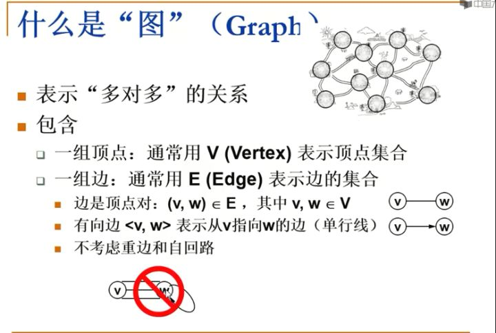
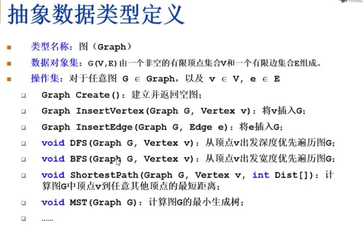
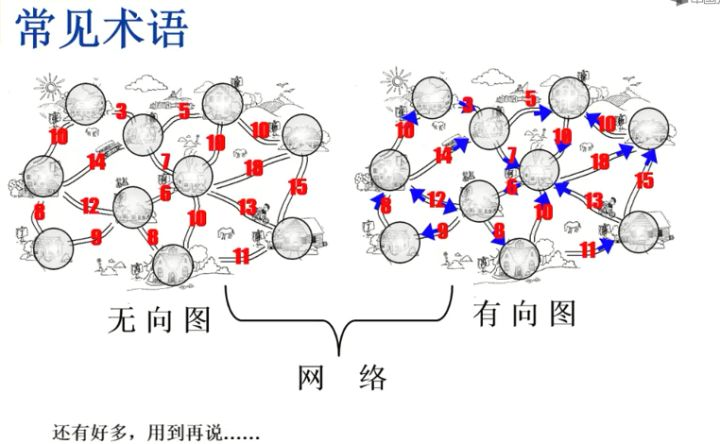
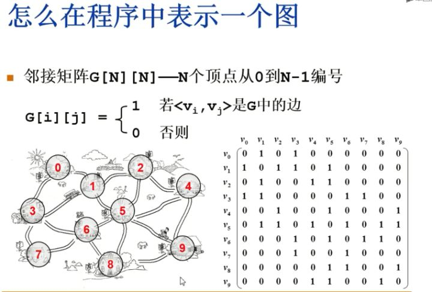
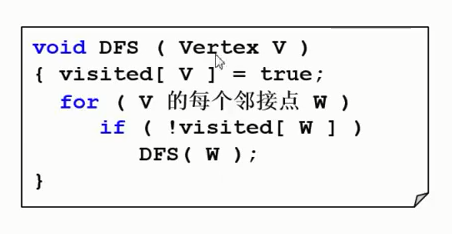
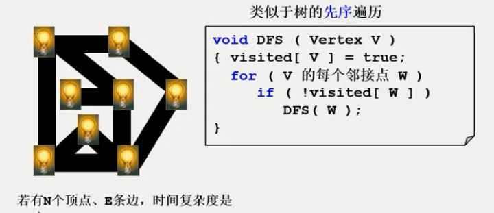

* [什么是图](#什么是图)
	* [图表示多对多的关系](#图表示多对多的关系)
	* [抽象数据类型定义](#抽象数据类型定义)
	* [常见术语](#常见术语)
	* [邻接矩阵表示](#邻接矩阵表示)
	* [邻接表表示](#邻接表表示)
	* [图的遍历](#图的遍历)
		* [深度优先搜索](#深度优先搜索)
		* [广度优先搜索](#广度优先搜索)

# 什么是图？

社交网络里面的六度空间理论就是图的应用

图里面很经典的最短路径问题，图里面最小生成树的问题

## **图表示多对多的关系**

之所以我们说它强大，是因为它把线性表和树全部都包含在内了，我们知道线性关系是一对一的关系，而树是一对多的关系，其实线性表和树全部都认为是图的特殊情况，当我们要描述一个图的时候，有两件事情一定要搞清楚，第一件事情，什么是它的顶点？图一定包含一组顶点，一组边

## 抽象数据类型定义

## 常见术语

- 无向图：图中所有的边无所谓方向
- 有向图：图中的边可能是双向，也可能是单向的，方向是很重要的
- 权值：给图中每条边赋予的值，可能有各种各样的现实意义
- 网络：带权值的图
- 邻接点：有边直接相连的顶点
- 出度：从某顶点发出的边数
- 入度：指向某顶点的边数
- 稀疏图：顶点很多而边很少的图
- 稠密图：顶点多边也多的图
- 完全图：对于给定的一组顶点，顶点间都存在边

## 邻接矩阵表示

- 特征：
	- 对角线元素全 0
	- 关于对角线对称
	
- 优点：
	- 直观、简单、好理解
	- 方便检查任意一对顶点间是否存在边
	- 方便找任一顶点的所有邻接点
	- 方便计算任一顶点的度
		- 无向图：对应行（或列）非 0 元素的个数
		- 有向图：对应行非 0 元素的个数是出度；对应列非 0 元素的个数是入度	
	
- 缺点：
	- 浪费空间——存稀疏图
	- 浪费时间——统计稀疏图的边

- [x] [无向图邻接矩实现](./GraphAdjacencyMatrix.cc)

## 邻接表表示

- 邻接表：G[N] 为指针数组，对应矩阵每行一个链表，只存非 0 元素

特点：

- 方便找任一顶点的所有邻接顶点
- 节省稀疏图的空间
  - 需要 N 个头指针 + 2E 个结点（每个结点至少 2 个域）
- 对于是否方便计算任一顶点的度
  - 无向图：方便
  - 有向图：只能计算出度
- 不方便检查任意一对顶点间是否存在边

- [x] [无向图邻接表实现](./GraphAdjacencyList.cc)

## 图的遍历

遍历这个词在图里面跟在树里面的意思是一样的，图的遍历就是指把图里面每一个顶点访问一遍，而且不能有重复的访问，首先一个问题是说，我们干嘛要做这件事呢？不要小看这件事看上去非常简单，它可以用来解决很多有趣的问题

两种非常典型的遍历方法，一种叫做DFS(Depth First Search, DFS)，一种叫做BFS(Breadth First Search, BFS)

### 深度优先搜索

我们要讲清楚，深度优先搜索是怎么做的，可以先通过一个迷宫的例子来看一下，假设我们有这样的一个迷宫，然后在迷宫的各个角落处都有一个灯泡，我们要一个个的把它们点亮，假定给定了迷宫的入口，先把入口的灯泡点亮了。

站在这个路口，我要去点亮下一盏灯，我要怎么想呢？站在入口处，有三盏灯都在视力范围内看的到的，我挑一盏灯先把它点亮，比如说我挑这盏灯

现在站在上图鼠标所在的灯的位置，可以看到两盏灯，其中一盏灯已经是点亮了，还有一盏灯没有亮，那我走下去，把这盏灯点亮，

同样的站在这个路口，我可以发现下面有一盏灯可以点亮，

在这个路口我选择又多了，我有三盏灯可以选，我选了其中一盏灯，比如说我先往上走，走到这的时候，发现还有一盏灯没亮，

然后就把它点亮，点亮之后，站在这个位置，放眼一望，所有灯都亮了，那么我要怎么办呢？我要原路返回，退到这个路口，

退到这个路口，我能看到的三盏灯也全都亮了，这个时候我也看到了出口，是不是就可以从这直接出去了呢？

千万别，因为还有两盏灯没有点亮，但是我怎么知道点亮了没有呢？为了保险起见，任何时候在我视力范围内，如果所有灯都亮了，我都要原路返回，

原路返回到这个地点的时候，我会发现，还有两盏灯没亮，我就选了其中一条路走了过去

然后再选了一条路走过去，把这盏灯点亮，

点亮这盏灯的时候，同样的道理，视力范围内能见的灯全都亮了，而且我看见出口了，我能直接从这出去吗？不可以，因为你不知道其它灯还有分叉口，所以为了保险起见，你是不能从任何一个结点直接出去的，一定要原路返回，一路返回到出口的时候，你才可以很放心的说这个迷宫里面所有的灯都被我点亮了，一个都没有漏下，刚才演示的就是深度优先搜索的过程，这里面注意到一个特点，当它访问了所有结点的灯以后，它一定是原路返回，原路返回的行为对应是什么呢？在程序里面，它实际上对应就是入栈出栈的行为，这就是我们深度优先搜索的伪码描述，

我从某一个迷宫的入口进来，第一件事情，我要给每一个结点定义一个变量，叫做visited，叫做访问，visited等于true的时候，相当于我把这盏灯点亮了，所以我访问到这个结点的时候，我先把它的灯点亮，然后对于v的每个邻接点w，就是站在v这个位置，放眼一望可以看的到的那些灯，如果这个灯还没有被点亮的话，那么我走到这盏灯的位置，递归的去调用DFS，当我递归的对w调用dfs的时候，我也是先把w的灯点亮，然后站在它的位置上去找每一个邻接点，如果还有没点亮的，我再递归的把它点亮，如果所有邻接点的灯都点亮了，会发生什么事情呢？

那么我这个DFS的调用就结束了，我要返回上一层，返回上一层对应的就是原路返回的过程，说到这，大家有没有觉得这个程序看上去略眼熟呢？如果你去想一下那个树，这个实际上相当于是什么？相当于树的先序遍历，整个DFS是先序遍历的推广

接下来的问题就是，如果给定的图里面如果有N个顶点，E条边，那么DFS的时间复杂度是多少呢？其实我们说这个时候问时间复杂度其实这个问法不科学，它取决你那个图在程序里面到底是怎么表示的，如果我们是用邻接表来存这个图的话，那么v的每个邻接点，我只要访问这个v对应的那条链表，一个一个访问过去就好了，链表上面邻接点的总个数是等于它的边数，实际上是两倍的边数，总的时间复杂度应该是对于每个点访问了一次，然后每条边访问了一次，所以是**O(N+E)**这个时间复杂度，如果我们使用邻接矩阵存储图的时候，当我们在说v的每个邻接点的时候，实际上我们是需要把这个邻接矩阵对应v的一整行，N个顶点全部都要访问一遍，我才知道哪个是它的邻接点，所以呢，整个时间复杂度是**O(N^2)**

v1 + (incident edges) + v2 + (incident edges) + ... + vn + (incident edges) 
= 
(v1 + v2 + ... + vn) + ( (incident edges v1) + (incident edges v2) + ... + (incident edges v3) )
=
O(N) + O(2E)
=
O(N+E)

- [x] [无向图邻接表深度优先搜索实现](./DFS.cc)