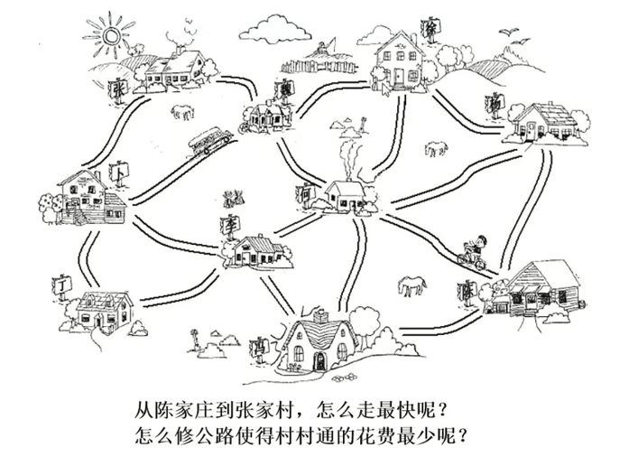
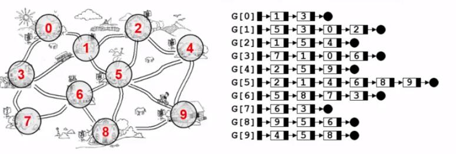

* [什么是图](#什么是图)
	* [图表示多对多的关系](#图表示多对多的关系)
	* [抽象数据类型定义](#抽象数据类型定义)
	* [常见术语](#常见术语)

# 什么是图？

社交网络里面的六度空间理论就是图的应用

图里面很经典的最短路径问题，图里面最小生成树的问题

## **图表示多对多的关系**

之所以我们说它强大，是因为它把线性表和树全部都包含在内了，我们知道线性关系是一对一的关系，而树是一对多的关系，其实线性表和树全部都认为是图的特殊情况，当我们要描述一个图的时候，有两件事情一定要搞清楚，第一件事情，什么是它的顶点？图一定包含一组顶点，一组边

## 抽象数据类型定义

## 常见术语

- 无向图：图中所有的边无所谓方向
- 有向图：图中的边可能是双向，也可能是单向的，方向是很重要的
- 权值：给图中每条边赋予的值，可能有各种各样的现实意义
- 网络：带权值的图
- 邻接点：有边直接相连的顶点
- 出度：从某顶点发出的边数
- 入度：指向某顶点的边数
- 稀疏图：顶点很多而边很少的图
- 稠密图：顶点多边也多的图
- 完全图：对于给定的一组顶点，顶点间都存在边

## 邻接矩阵表示

- 特征：
	- 对角线元素全 0
	- 关于对角线对称
	
- 优点：
	- 直观、简单、好理解
	- 方便检查任意一对顶点间是否存在边
	- 方便找任一顶点的所有邻接点
	- 方便计算任一顶点的度
		- 无向图：对应行（或列）非 0 元素的个数
		- 有向图：对应行非 0 元素的个数是出度；对应列非 0 元素的个数是入度	
	
- 缺点：
	- 浪费空间——存稀疏图
	- 浪费时间——统计稀疏图的边

- [x] [无向图邻接矩实现](./GraphAdjacencyMatrix.cc)

## 邻接表表示

- 邻接表：G[N] 为指针数组，对应矩阵每行一个链表，只存非 0 元素

特点：

- 方便找任一顶点的所有邻接顶点
- 节省稀疏图的空间
  - 需要 N 个头指针 + 2E 个结点（每个结点至少 2 个域）
- 对于是否方便计算任一顶点的度
  - 无向图：方便
  - 有向图：只能计算出度
- 不方便检查任意一对顶点间是否存在边

- [x] [无向图邻接表实现](./GraphAdjacencyList.cc)