* [什么是数据结构](#什么是数据结构)
	* [解决问题方法的效率](#解决问题方法的效率)
	* [数据结构定义](#数据结构定义)
	* [抽象数据类型](#抽象数据类型)
	* [算法](#算法)
		* [描述算法的手段](#描述算法的手段)
		* [什么是好的算法](#什么是好的算法)
		* [复杂度的渐进表示法](#复杂度的渐进表示法)
		* [复杂度分析小窍门](#复杂度分析小窍门)
* [相关代码](#相关代码)
* [相关算法](#相关算法)
	* [分治法](#分治法)

# 什么是数据结构
* 在计算机科学中，数据结构（英语：data structure）是计算机中存储、组织数据的方式。——中文维基百科

## 解决问题方法的效率
1.跟数据的组织方式有关
2.跟空间的利用效率有关
3.跟算法的巧妙程度有关

## 数据结构定义
* 数据对象在计算机中的组织方式
	* 逻辑结构
	> 什么是逻辑结构，比如说我们一开始把书架想象成一个一长条一层的架子，然后所有的书是一个挨着一个放的，除了一头一尾的书以外呢，每一本书它前面只有一本书，后面只有一本书，如果我给每一本书有一个编号的话，那么这一个编号对应的就是一本书，那么这种结构呢是一对一的结构，我们管它叫线性结构，另外一种组织方式，就是先把图书来分类，那如果我给每一类一个编号的话，那么这一个类别的编号里面对应着很多本书，那么这是一个一对多的逻辑结构，那这种结构有个名字叫作树，树(一对多)，前面讲的就是线性结构和树型结构。后面就会讲图，假设我们还会统计这些信息，这本书都会有哪些人买过？买了这本书的人他还买过其它的什么书？于是呢，其实就是一本书对应着很多人，而一个人又对应了很多本书，这是一个多对多的很复杂的关系网，那么这个关系网对应的就是一个图的结构。
	* 物理存储结构
	> 这些逻辑结构在机器的内存里面到底要怎么样一个放法，是连续放呢？还是东一个，西一个隔开放呢？也就是用一个数组来存它呢？还是用一个链表来存它呢？这个就属于物理存储结构
* 数据对象必定与一系列加在其上的操作相关联
* 完成这些操作所用的方法就是算法

## 抽象数据类型
* 数据类型
	* 数据对象集
	* 数据集合相关联的操作集
* 抽象：描述数据类型的方法不依赖于具体实现
	* 与存放数据的机器无关
	* 与数据存储的物理结构无关
	* 与实现操作的算法和编程语言均无关
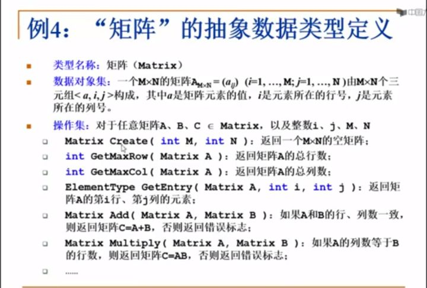
> 只描述数据对象集和相关操作集“是什么”，并不涉及“如何做到”的问题

# 算法
* 一个有限指令集
* 接受一些输入(有限情况下不需要输入)
* 产生输出
* 一定有限步骤之后终止
* 每一条指令必须
	* 有充分明确的目标，不可以有歧义
	* 计算机能处理范围内
	* 描述应不依赖于任何一种计算机语言以及具体的实现手段

## 描述算法的手段
1.空间复杂度 S(n)
根据算法写成的程序在执行时**占用存储空间的长度**
2.时间复杂度 T(n)
根据算法写成的程序在执行时**耗费的时间的长度**

## 什么是好的算法
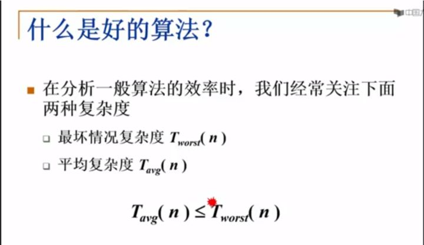
> 一般情况下更多关注的是最坏情况复杂度

## 复杂度的渐进表示法
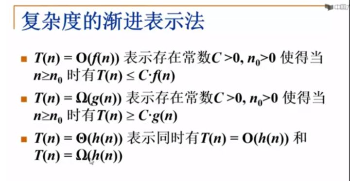
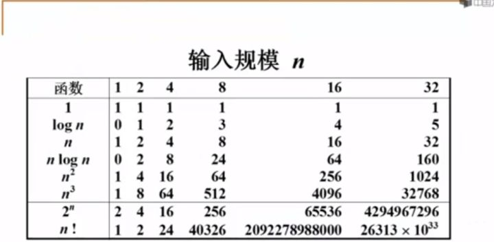
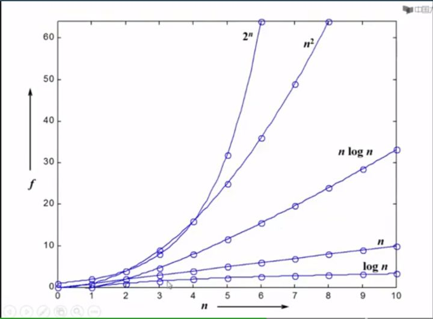
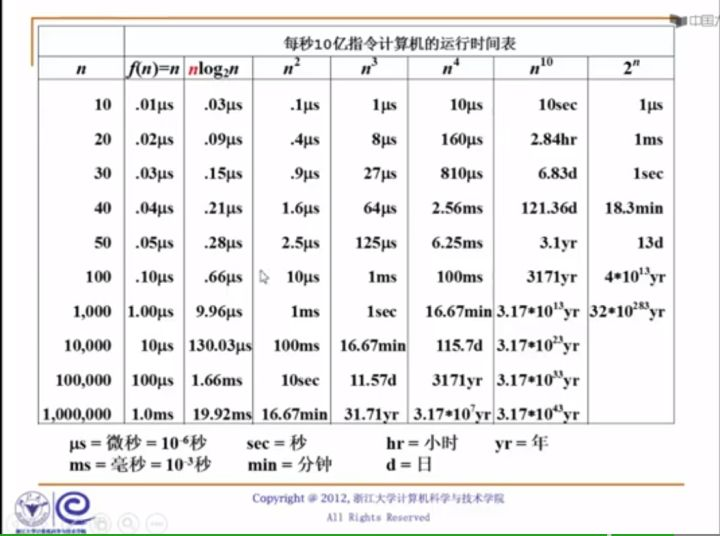

## 复杂度分析小窍门
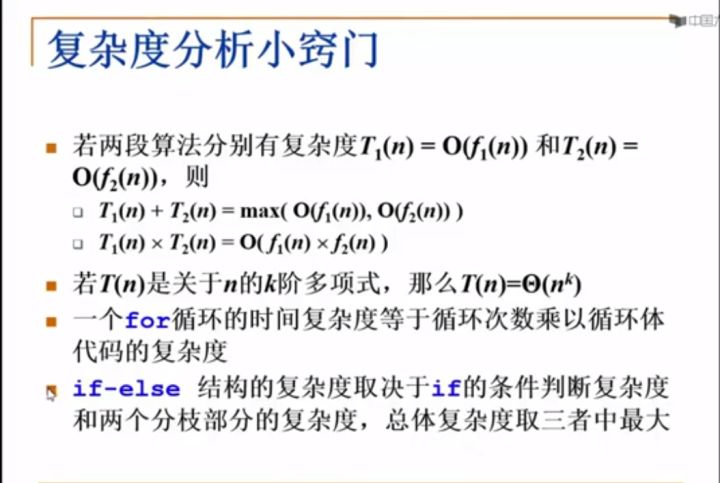

## 相关代码
- [x] [打印N个整数，循环](./PrintN_for.cc)
- [x] [打印N个整数，递归](./PrintN_for.cc)
> 空间复杂度太大，可能程序直接爆掉，时间复杂度太大，可能等了很长时间都等不出结果。
这个例子是我们前面看过的一个打印N个整数的，递归写出来的程序，我们说递归的程序在N=100000的时候，在机器上就非正常跳出了，到底发生了什么事情呢？我们这来仔细的看一下，假设在内存里面有这么一块空间，这个程序可以用的，我们开始调用PrintN，然后把100000作为参数传给它，这个时候程序做了一件什么事情呢？这个N传进来判断了一下N不等于0，于是递归调用PrintN，调用这个函数之前，你的系统需要把当前的函数所有现有的状态都存到系统内存的某一个地方，那我在这写100000，并不是说占了100000个格子，而是说这块空间是为了PrintN(100000)这个程序而存储的，把它当前的状态先存下来，然后我们再去执行PrintN(N-1)这个函数，执行完了以后，系统会把这些存储的状态再恢复回来，接着执行这个函数的下一句，因为它是一个递归调用的，于是下一步就是调用PrintN(99999)，然后进去以后发现，我们先得调用PrintN(99998)，于是这个程序所有的变量要被存一下，然后调用PrintN(99998)，然后继续存，继续存，一直到最后什么时候可以返回了呢？当我们调用PrintN(0)的时候可以返回，那么在调用PrintN(0)之前，我们必定调用了PrintN(1)，所以最后存在系统里的一块内容应该是PrintN(1)这个函数所有的当前的状态，于是我们就发现它在内存里面占用的空间的数量，实际上跟我N原始的大小成正比的，也就是空间复杂度作为一个N的函数的话，是一个常数乘以N，也就是随着N来做线性增长的，当这个N非常非常大的时候，你的程序可以用的空间是有限的，它把它有限的空间用爆掉了，所以它就非正常退出了。
- [x] [求一元多项式的值](./Multinomial.cc)
> 接下来的例子回顾一下求多项式的值，有一个函数特别傻，有一个函数很聪明，而事实上我们也发现第二个函数比第一个函数快很多，具体为什么会这样呢？我们在分析一个函数运行效率的时候，在一个这么简单的函数里面，它只有加减乘除，机器运算加减法的速度比乘除要快很多，所以我们基本上就是在数函数到底做了多少次乘除法，加减法可以忽略不计，那我们现在就来具体的数一下，它到底做了多少次乘法，上面一种笨的算法，这个for循环一共执行了n次，pow函数算的是x的i次方，简单的计算累乘的方法，x的i次方就是做了i-1次乘法，然后再加上跟前面的系数相乘（a[i] * pow(x， i))，每一次循环里面执行的是i次乘法，于是乘法的总次数就是从1一直加到n，第二个程序真的是每一个循环里面就只有一次乘法，一共执行了n次循环，所以非常简单，一共就只做了n次乘法。
- [x] [最大子列和问题](./Maximum_subsequence.cc)
> 给定K个整数组成的序列{ N1， N2， …， Nk }，“连续子列”被定义为{ N​i， N​i+1， …， Nj }，其中 1≤i≤j≤K。“最大子列和”则被定义为所有连续子列元素的和中最大者。例如给定序列{ -2， 11， -4， 13， -5， -2 }，其连续子列{ 11， -4， 13 }有最大的和20。现要求你编写程序，计算给定整数序列的最大子列和。

## 相关算法
### 分治法

先把数组一分为二，递归的去解决左边的问题，得到左边的最大子列和，递归的去解决右边的问题，得到右边的最大子列和，然后就可以了吗？然后我们就可以说这两个数中间最大的一个就一定是结论吗？那可不一定，还有一种情况，还有一种情况就是跨越边界的最大子列和，把这3个结果找到以后，那我们真的可以说，最后的结果一定是这3个数中间最大的那一个，
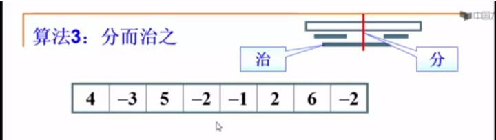
为了能更好的理解这个算法，我们来看一个具体的例子，比如说给了8个数字，第一步把它从中间一分为二，然后递归的先解决左半边，再递归的进入左半边的时候呢，继续把它一分为二，继续的递归到左半边，然后继续分
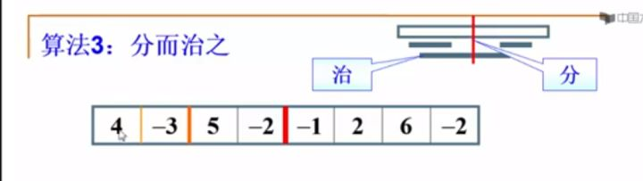
分的时候我们会得到最大子列和，
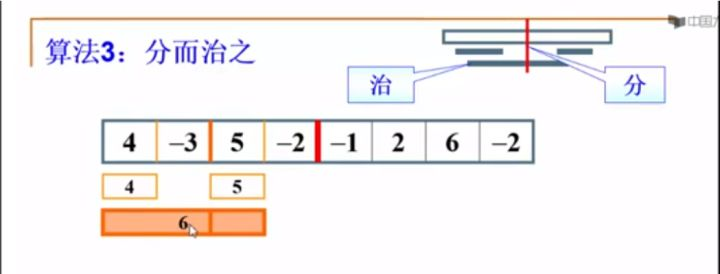
左边应该返回6，然后你知道可以怎么解决右半边的问题了，
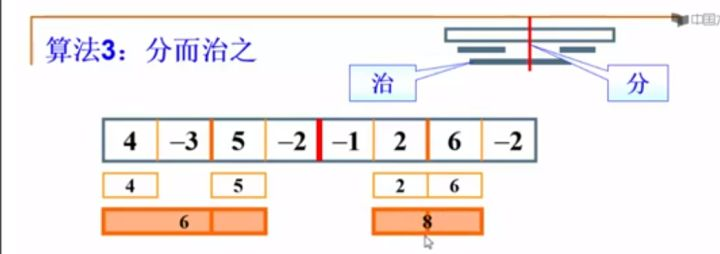
返回11作为最终的解，看上去也不是很复杂，教科书里面有，大家可以自己去看，难点在于怎么样分析它的算法复杂度，这个算法真的是nlogn吗？分析这种递归的算法略微有些难度，当我解决整个问题有n个数字的时候，如果我的复杂度把它记作T(n)的话，那么我得到这半边的复杂度就是T(n/2)，因为我的规模减半了，而我是怎么得到中间跨边界最大子列和的呢？我们的做法就是从中间开始，往左边扫描，然后往右边扫描，每一个元素都被扫描了一次，所以得到这个结果的复杂度应该是O(N)的常数倍，由此我们就得到了T(N)的递推公式，
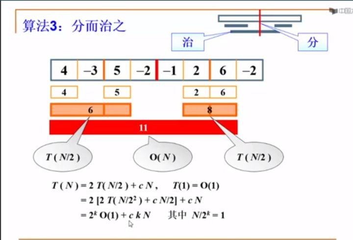
一直往下展开，展开到T里面的数等于1为止，过了k步以后，右边是每展开一层就多一个cN，展开k步以后就是ckN， 其中k和N是什么关系呢？就是N/2，除了k次以后，最终它会得到1，它可能不一定整除成1，但是也差不多，道理是一样的，所以2^k就是N，k就是logN，以2为底的logN，所以在分析复杂度的时候，我们就有了两项，一项是O(N)，一项是O(NlogN)，当两个复杂度加在一起的时候，我们取的是比较大的那一项，于是我们就得到了整个算法的复杂度O(NlogN)，
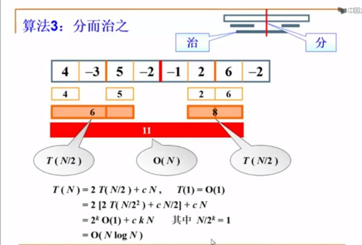