* [什么是线性表](#什么是线性表)
	* [线性表的抽象数据类型描述](#线性表的抽象数据类型描述)
	* [线性表代码实现](#线性表代码实现)
* [什么是堆栈](#什么是堆栈)
	* [堆栈的抽象数据类型描述](#堆栈的抽象数据类型描述)
	* [堆栈代码实现](#堆栈代码实现)
* [什么是队列](#什么是队列)
	* [队列的抽象数据类型描述](#队列的抽象数据类型描述)
	* [队列代码实现](#队列代码实现)
* [相关代码](#相关代码)

# 什么是线性表
线性表(Linear List): 由同类型数据元素构成有序序列的线性结构
* 表中元素个数称为线性表的长度
* 线性表没有元素时，称为空表
* 表起始位置称表头，表结束位置称表尾

## 线性表的抽象数据类型描述
* 类型名称: 线性表(List)
* 数据对象集：线性表是n(>=0)个元素构成的有序序列(a1,a2,...,an)
* 操作集： 线性表L, 整数i表示位置，元素X，线性表基本操作主要有：
	* List MakeEmpty(): 初始化一个空线性表L；
	* ElementType FindKth(int K, List L): 根据位序K,返回相应元素；
	* int Find(ElementType X, List L): 在线性表L中查找X的第一次出现位置；
	* void Insert(ElementType X, int i, List L): 在位序i前插入一个新元素X；
	* void Delete(int i, List L): 删除指定位序i的元素；
	* int Length(List L): 返回线性表L的长度n。

## 线性表代码实现
- [x] [线性表的顺序存储实现](./Arr_list.cc)
- [x] [线性表的链式存储实现](./List.cc)

# 什么是堆栈
堆栈（Stack）：具有一定操作约束的线性表
* 只在一端（栈顶，Top）做插入、删除
* 插入数据：入栈（Push）
* 删除数据：出栈（Pop）
* 后入先出：Last In First Out（LIFO）

## 堆栈的抽象数据类型描述
* 类型名称：堆栈（Stack）
* 数据对象集：一个有 0 个或多个元素的有穷线性表
* 操作集：长度为MaxSize的堆栈S，堆栈元素item
* 堆栈的基本操作主要有：
	* Stack CreateStack(int MaxSize)：生成空堆栈，其最大长度为MaxSize
	* int IsFull(Stack S,int MaxSize)：判断堆栈S是否已满
	* void Push(Stack S,ElementType item)：将元素item压入堆栈
	* int IsEmpty(Stack S)：判断堆栈S是否为空
	* ElementType Pop(Stack S)：删除并返回栈顶元素

## 堆栈代码实现
- [x] [堆栈的顺序存储实现](./Arr_stack.cc)
- [x] [堆栈的链式存储实现](./Stack.cc)

# 什么是队列
队列（Queue）：具有一定操作约束的线性表
* 插入和删除操作：只能在一端（front）插入，而在另一端（rear）删除
* 数据插入：入队列（AddQ）
* 数据删除：出队列（DeleteQ）
* 先进先出： First In First Out（FIFO）

## 队列的抽象数据类型描述
* 类型名称：队列（Queue）
* 数据对象集：一个有 0 个或多个元素的有穷线性表
* 操作集：长度为MaxSize的队列Q，队列元素item
* 队列的基本操作主要有：
	* Queue CreateQueue(int MaxSize)：生成长度为MaxSize的空队列
	* int IsFull(Queue Q)：判断队列Q是已满
	* void AddQ(Queue Q,ElementType item)：将数据元素item插入队列Q中
	* int IsEmpty(Queue Q)：判断队列Q是否为空
	* ElementType DeleteQ(Queue Q)：将队头数据元素从队列中删除并返回

## 队列代码实现
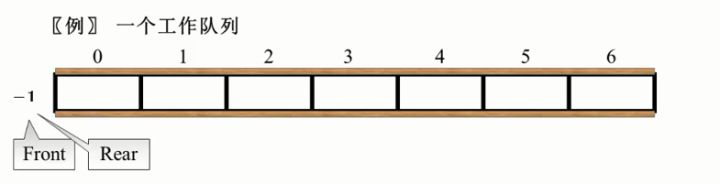

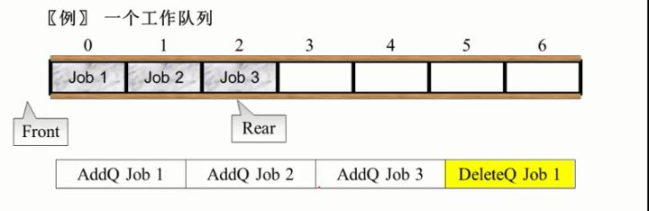

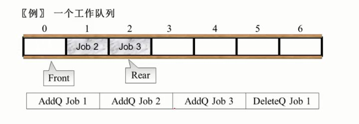

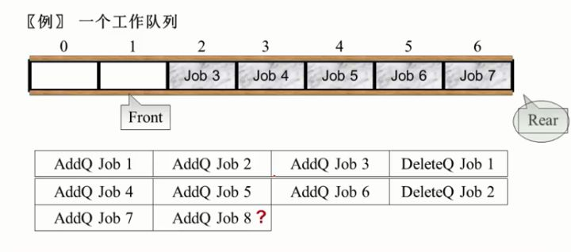

明明还有空间，所以可以把新来的元素排到前面去，所以就形成了循环队列

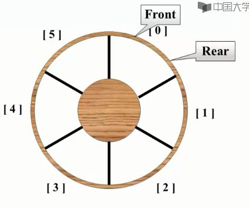

front == rear时，队列为空，rear是指向队列中实际的最后一个元素的位置，而front是第一个元素的前一个，所以当front与rear相等的时候，就意味着这个队列里是没有元素的

**队列空： front == rear**

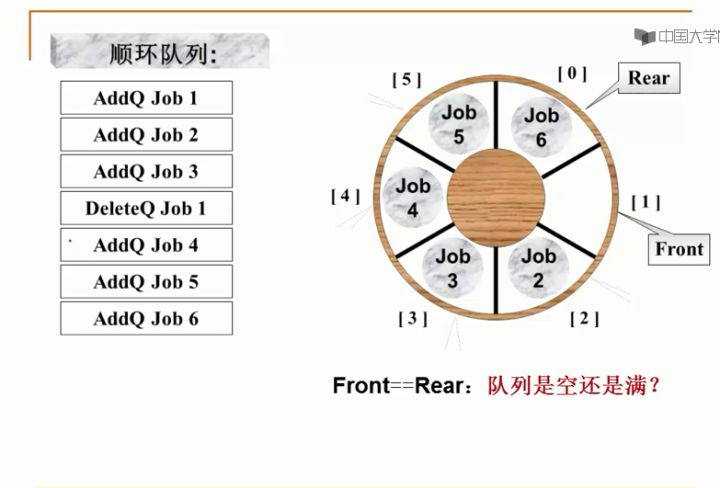

这时会出现一个问题，分不清队列到底是空的还是满的

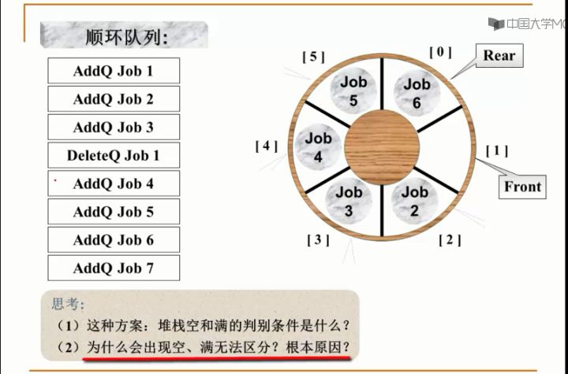

在这里是根据front,rear的距离来判别是空，还是满的，而front,rear的取值范围是0到n-1,

对于此例来说是0到5，所以front与rear的差距是6种情况

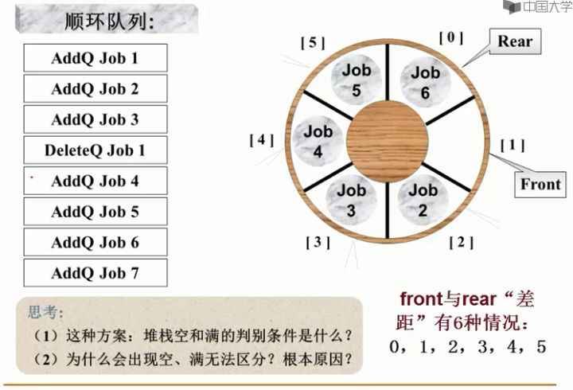

如果数组大小是n的话，front与rear的距离差距的情况就是n种

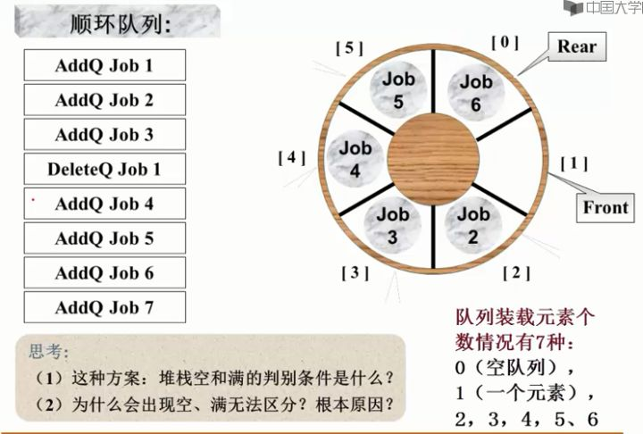

数组大小为n的话，对列的装载元素有n+1种，而我们要判别队列空满的状态是根据front,rear的差距，这个差距只有n种情况，想用n种状态来区分实际上存在的n+1种情况，怎么可能？一定有矛盾

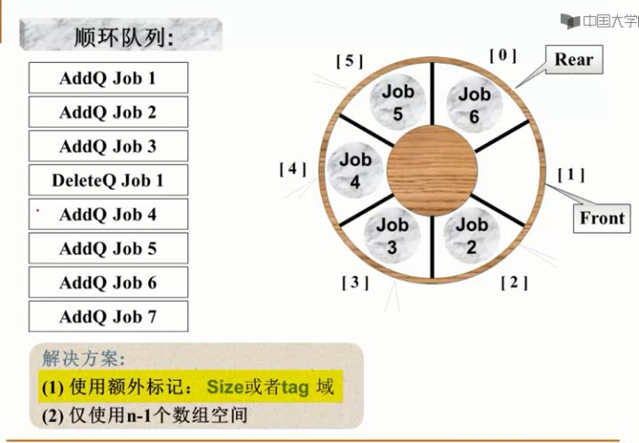

1. 根据size是0还是1去判断队列是空的还是满的，当插入一个元素时，tag为1，删除一个元素时，tag为0，所以搞不清楚是空还是满的时候，就要去看这个tag，这个tag就代表了最后一个元素是插入还是删除，那么就能知道到底是空还是满。
2. 数组不放满，不放n个元素，最多只放n-1个元素。
(1) 入队列
```
void AddQ(Queue PtrQ, ElementType item){
    if ((PtrQ->rear + 1) % MaxSize==PtrQ->front){
        printf("队列满");
        return;
    }
    PtrQ->rear = (PtrQ->rear+1)%MaxSize;
    PtrQ->Data[PtrQ->rear]=item;
}
```
怎样判别队列是不是满的呢？

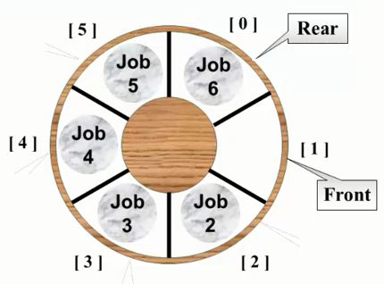

当前这个状态就是满的，要加入一个元素，rear要加1，rear加1跟front碰上了，所以这个时候我们就认为它是满的，这是一个循环队列，一个个放，5的下一个位置是0，那么在程序上面怎么实现5的下一个变成0呢？我们用求余函数，5+1对6求余就是等于0了，这是我们实现循环队列的方法。

(2)出队列
```
ElementType DeleteQ(Queue PtrQ){
    if (PtrQ->front == PtrQ->rear){
        printf("队列空");
        return ERROR;
    }else{
        PtrQ->front = (PtrQ->front+1)%MaxSize;
        return PtrQ->Data[PtrQ->front];
}
```
front是指向队列头上的前一个，所以front+1指向的正好是队列头上元素的位置

- [x] [队列的顺序存储实现](./Arr_queue.cc)
- [x] [队列的链式存储实现](./Queue.cc)

# 相关代码
- [x] [一元多项式的乘法与加法运算](./Polynomial.cc)
- [x] [二分法查找](./Binary_search.cc)
- [x] [四则运算](./Arithmetic.cc)

中缀表达式如何转换为后缀表达式：
1. 从头到尾读取中缀表达式的每个对象，对每个对象按不同的情况处理。
2. 运算数：直接输出
3. 左括号：压入堆栈
4. 右括号：将栈顶的运算符弹出并输出，直到遇到左括号（出栈，不输出）；
5. 运算符：
    * 5.1 若优先级大于栈顶运算符时，则把它压栈；
	* 5.2 若优先级小于等于栈顶运算符时，将栈顶运算符弹出并输出；再比较新的栈顶运算符，
	* 5.3 直到该运算符大于栈顶运算符优先级为止，然后将该运算符压栈；
6. 若各对象处理完毕，则把堆栈中存留的运算符一并输出。
7. 从入后缀表达式求值：
8. 运算数：入栈；
9. 运算符：从堆栈中弹出适当数量的运算数，计算并结果入栈；
10. 最后，堆栈顶上的元素就是表达式的结果值。
