* [排序前提](#排序前提)
* [简单排序](#简单排序)
	* [冒泡排序](#冒泡排序)
	* [插入排序](#插入排序)
	* [希尔排序](#希尔排序)

# 排序前提

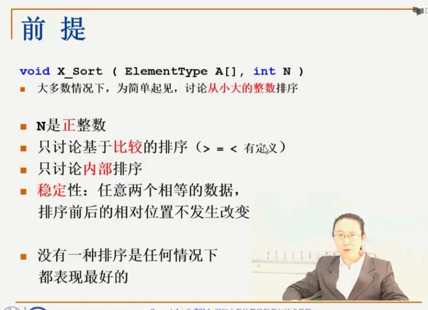

- 内部排序：我们假设我们的内存空间充分大，所有的数据都可以一次性的被导到内存空间里，然后我们所有的排序过程是在内存里面一次性完成的，这个叫做内部排序，
- 外部排序：比如说你的内存空间有2GB，但是呢，要求你对10TB的数据进行排序，内部排序就不可能了，因为你的内存不够大，装不下所有的数据，这就涉及到了外部排序

# 简单排序

## 冒泡排序

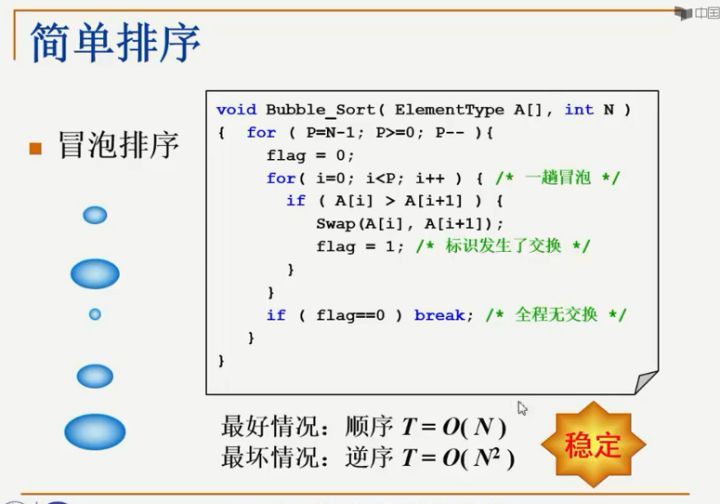

那我们看一下这个冒泡排序的时间复杂度，它有两种情况，一种是最好的情况，一种是最坏的情况，最好的情况就是一开始这些泡泡都是排好序的，从始至终，我都不需要执行任何一次的交换，但是呢，无论如何，我得从上到下扫描一遍，所以我们的最好情况是说，一开始它已经是它已经是顺序的，那我只需要从头到尾扫描一遍整个的序列，用一个O(N)的时间，我就可以从这里break，跳出这个循环了，最坏情况是什么样的呢？整个是逆序的，一开始的时候，最大的泡泡在最上面，最小的泡泡在最下面，于是呢，每一趟排序我们都只能把最大的泡泡挪到下面来，然后下一趟排序，次大的泡泡挪到下面来，我们必须要走满这n-1趟排序，然后每一趟排序，两两元素要不停的做交换，所以最坏情况下是逆序，时间复杂度是O(N^2)

冒泡排序的好处是什么，非常简单，这个程序，如果你要不加这个标识的话，就是两重for循环加一层if判断，相当简单，当然了，它的表现就不是很好，一个O(N^2)数量级的排序算法往往是不可接受的，但是为什么说冒泡排序也有它的好处呢？它有一个好处是别的排序算法比不了的，我们在这虽然写的好像是说所有的待排元素都放到一个数组里，但是如果有一种情况比较变态，所有的待排元素是放在一个单向链表里的，那个时候你要怎么做呢？等你学了更多的排序算法以后，你可以回过头来想一想冒泡排序是没问题的，它每次是从上到下往一个方向扫描，而且每次交换相邻的两个元素，这个对于数组没有问题，对于链表呢，也没有问题，但是其它的排序算法呢，好像就不容易做到这一点，那另外，冒泡排序还有一个好处，就是你要注意到，我们什么时候做交换呢，只有当这个元素严格大于下一个元素的时候，我们才做交换，如果它们两个是相等的话，我们是不做交换的，这点内就保证了，我们这个排序算法它是稳定的。

- [x] [冒泡排序](./BubbleSort.cc)

## 插入排序

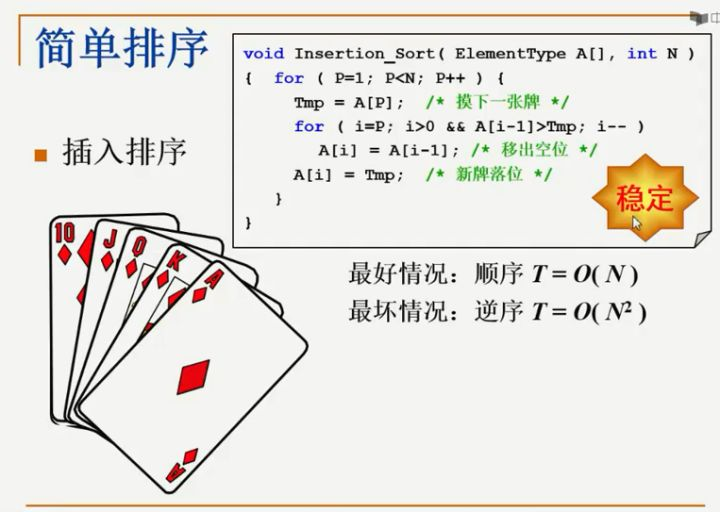

插入排序，插入排序可以理解为，如果你会打牌的话，理解为怎么抓一手顺序牌，比如说我第一张牌摸进来是J，然后第二张牌摸进来是K，一般来说我们把K放到J的后面，因为我们觉得K要J大，第三张牌进来的时候，它是A，那么我们怎么做呢？就是A跟K比，我需要跟J比吗？不需要跟J比，因为我发现它比K大，所以它直接就放在K的后面了，那下一张牌进来的时候，如果是Q，那张牌进来以后，我们该怎么办呢？我们要做的是将K，A两张牌往后错一下，空一个位置出来，让这张新的牌插入，那这是一个什么样的过程呢？实际上我在把Q插进来之前，我把它跟A比了一下，它比A要小，所以应该排在A前面的，于是A这张牌要往后错一位，它又比K小，K也得往后错一位，然后它发现它比J要大，好了，J不用错位了，这个空位就是它的，这就是插入排序的一个过程，那最坏情况是什么呢，就是在这个情况下，我插进来下一张牌是10，我得把4张牌一个一个向后错位，然后把最前面的位置空出来，10插进去

那么我们的插入排序呢，其实就可以把它理解为整个抓一手牌的过程，循环是从第一张牌开始，循环到最后一张，为什么不是从第0张牌呢？我们不是从0开始记号的吗？没有必要，我们假设一开始的时候第0张牌已经在我们手里面了，然后我需要从下一张牌开始摸进来，摸了下一张牌，放在临时的位置上，然后我要这么做呢？我要跟手里现在有的牌一一对比，要从哪比起呢？要从最后一张牌往前比，所以我有这样一个for循环，是从当前最后一张牌的位置，开始减减，开始往前比，一直到它等于0，比到最前面那张牌为止，比的时候会是怎么一个比法呢？只要我手里这张牌比现在这张牌要小，那么就应该怎么办？现在的这张牌，就应该往后错位，什么叫往后错位呢？也就是把A[i-1]这张牌要存到A[i]的位置上去，也就是把这张牌向后移了一位，一直不停的重复这个过程，直到什么时候为止呢？直到说我手里这张牌是大于等于现在这张牌了，就像我刚才插Q进去的时候，发现Q已经大于J了，那么这个时候就停止，停止跳出这个for循环的时候，那这个i所指的位置就是我手里这张牌应该放的空位置，那这叫新牌落位，这就是插入排序的过程

其实对于插入排序，最好的情况其实跟冒泡排序其实是一样的，就是一开始进来的时候，那个牌就是按顺序摸的，我先摸了一张10，然后我摸了一张J，去跟10比的时候，发现比它大，所以什么都不用动，我就直接放在后面了，下一张牌总比最后那张牌大，然后它就顺序的放在后面了，那在这种情况下呢，一张牌都不需要移动，但是我仍然需要把所有的牌都摸上来，所以最好情况呢，是一开始就是顺序的，那我只需要O(N)的时间把所有的牌都摸进来就好了，最坏是什么情况呢？我摸的第一张牌是A,第二张牌是K,所以我要把A往后错一位，第三张牌是Q，所以我得把这两张牌全部往后错一位，每摸进一张牌，它都需要把前面所有的牌向后错一位，那这个是什么情况呢，就是初始的情况是完全逆序的情况，那么我们每一次循环，这里面所有的牌都需要往后错一位，然后一共做了N-1次循环，所以整体来说时间复杂度是O(N^2)这个数量级的

那我们说插入排序的好处也是这个程序非常短，看上去非常的简单，而且它比冒泡排序好在哪呢？冒泡排序是两两交换，两两元素互换的时候，它要涉及到3步，插入排序其实是每个元素往后错，最后一次性的放在空位里面去，它会省很多的步骤，但是这其实不是插入排序存在的主要原因了，它有更好的性质，这个我们后面再说，因为我们是在当手里这张牌严格的比前面这张牌小的时候，我们才移位的，如果它们相等的话，这个位置是不动的，这样也就保证了插入排序这个算法它也是稳定的

- [x] [插入排序](./InsertSort.cc)

## 希尔排序

基本思路就是利用了插入排序的简单，同时呢，它要克服插入排序每次只交换相邻两个元素的缺点，那要理解这个shell sort,我们先来举个例子。

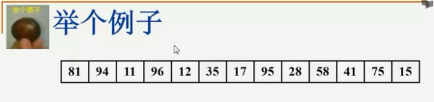

假设这是我们给定的一个数组，shell sort第一步要做的是我先做一个5间隔的排序，就是我考虑这个序列里面的一个子序列，这个子序列的元素呢，是每隔5个来选取的，也就是说，我先选了第一个元素，然后相隔4个元素，第5个元素，然后再相隔4个元素，第5个元素，

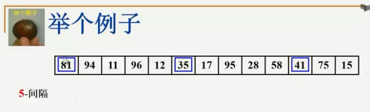

我用插入排序对这个子序列，这3个数字做一个插入排序，排序以后的结果呢，是放在它们相应的位置，然后继续考虑的是下面的一个5间隔的子序列，就是94，17，75

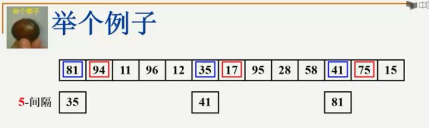

以此类推，考虑11，95，15，最后是96和28，

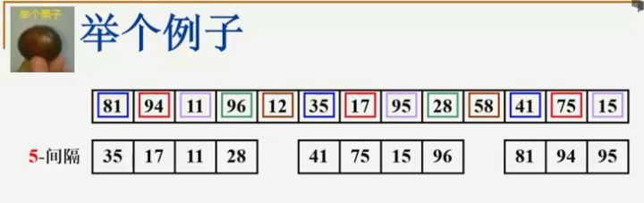

然后12和58

这就是5间隔排序以后的效果

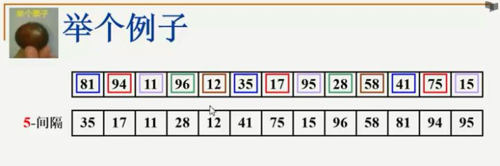

在5间隔排序完成了以后呢，他把这个数字稍微变少一点，变成3，我要做一个3间隔的排序，在5间隔排序结果的基础上，每隔3个取一个，这是一个3间隔排序

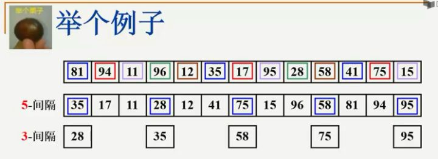

下一趟

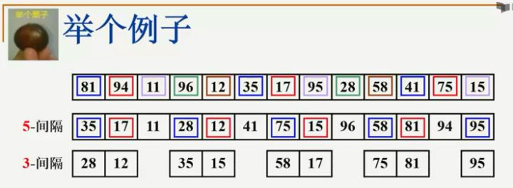

再下一趟

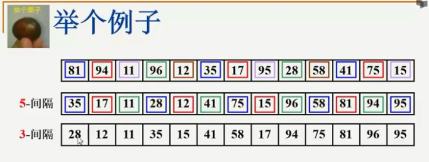

这是一个3间隔排序的结果，我们会看到序列情况有了非常明显的改善，当然最后我要保证这个序列有序的话，最后我还是得做1间隔的，彻底的插入排序，但是当我们最后在做1间隔的原始插入排序之前，我们发现3间隔的序列已经基本有序了，也就是大部分的逆序对已经在前面的两趟排序里面被消掉了，所以它的主要思想就是我先要定义一个增量序列，也就是我现在随便定义了一个5，3，1，你也可以定义你自己的数字，但是无论如何这个序列它是递减的，递减到最小的那个，最后一步必须是1间隔的，定义这个增量序列以后，我们对每一个增量进行增量间隔的排序，

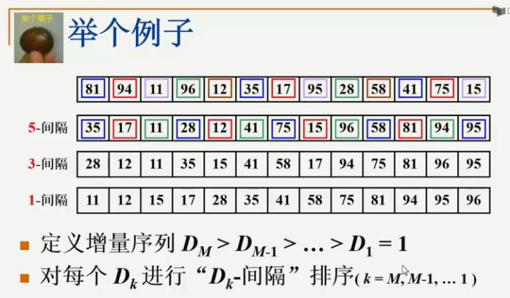

这个k是从M开始，一直减到1为止，那在这里头呢，有一个很重要的性质，我们必须要观察到，就是当我对这个序列先进行了5间隔的排序，然后又进行了3间隔的排序，问题是3间隔排序以后，这个3间隔排序的序列有序还是5间隔排序的序列有序？我们来看一下，在3间隔排序以后，我们看到28，隔4个，41，再隔4个，81，那么28，41，81，它们仍然是有序的，然后再看12，58和96也是有序的，仔细检查一遍，你会发现，3间隔有序的序列，还保持了前面5间隔有序的性质，也就是说更小间隔的排序，没有把上一步的结果变坏，这是一个非常重要的性质，否则的话，这个shell排序就不好用了，我们用文艺一点的说法，就是下图注意里面的注释

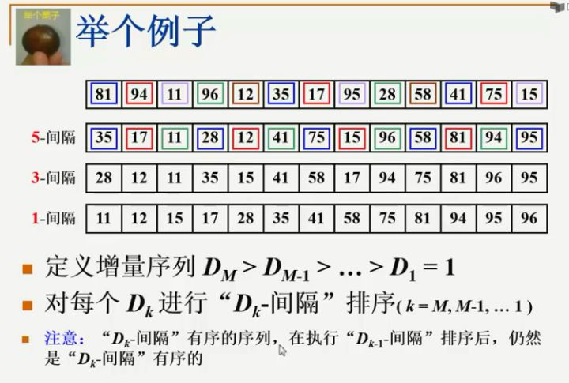

那看上去希尔排序是一个非常简单的算法，原始的希尔排序呢，也的确是非常简单的，它的增量序列是怎么选的呢？

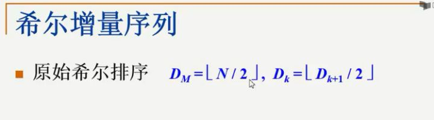

一开始取一个N/2，然后每次把这个增量除以2，每次减半，每次减半，最后减到1为止，所以shell排序原始的算法写起来是非常简单的，就是外面套一个大循环，是关于增量的，这是一个希尔的增量序列，它从N/2开始，一直到1为止，每次除以2

在这个大for循环的内部，它执行的就是一个非常直接的插入排序，你还记得原始的插入排序吗？原始的插入排序，

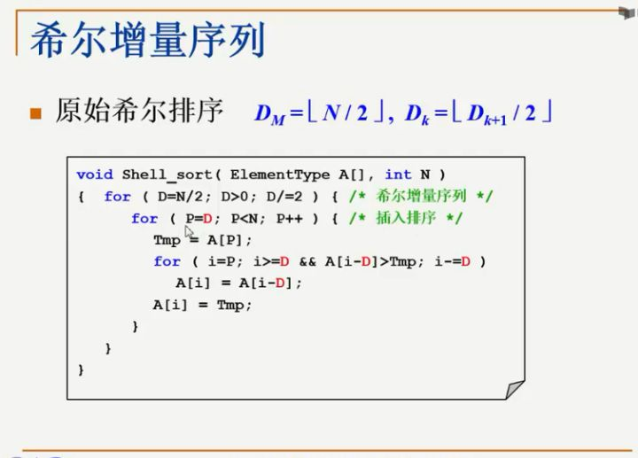

假设第0张牌已经在我们手里，我们每次是从第一张牌开始摸，那在这(就是指for(P=D; P<N; P++))因为间隔了D个距离，所以我们假设第0张牌在我手里，我下一张牌是从第D张牌开始摸，也就是说把原来的插入排序里的1全部换成D就可以了，所以这就是一个非常简单的shell排序的伪代码。

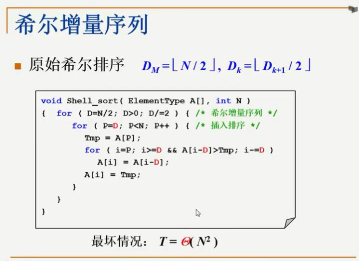

### Time Complexity

- **Worst Case Complexity**: less than or equal to `O(n2)`
- **Best Case Complexity**: `O(n*log n)`
- **Average Case Complexity**: `O(n*log n)`

- [x] [希尔排序](./ShellSort.cc)