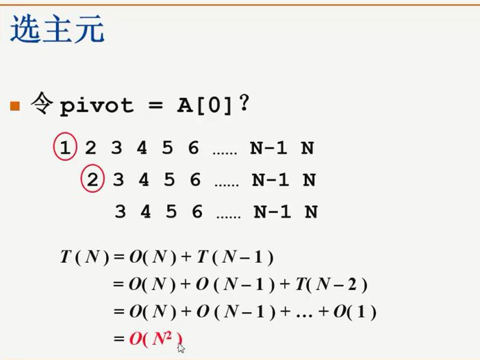
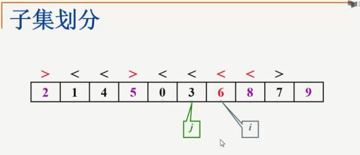

* [排序前提](#排序前提)
* [简单排序](#简单排序)
	* [冒泡排序](#冒泡排序)
	* [插入排序](#插入排序)
	* [希尔排序](#希尔排序)
	* [选择排序](#选择排序)
	* [堆排序](#堆排序)
	* [快速排序](#快速排序)

# 排序前提


- 内部排序：我们假设我们的内存空间充分大，所有的数据都可以一次性的被导到内存空间里，然后我们所有的排序过程是在内存里面一次性完成的，这个叫做内部排序，
- 外部排序：比如说你的内存空间有2GB，但是呢，要求你对10TB的数据进行排序，内部排序就不可能了，因为你的内存不够大，装不下所有的数据，这就涉及到了外部排序

# 简单排序

## 冒泡排序


那我们看一下这个冒泡排序的时间复杂度，它有两种情况，一种是最好的情况，一种是最坏的情况，最好的情况就是一开始这些泡泡都是排好序的，从始至终，我都不需要执行任何一次的交换，但是呢，无论如何，我得从上到下扫描一遍，所以我们的最好情况是说，一开始它已经是它已经是顺序的，那我只需要从头到尾扫描一遍整个的序列，用一个O(N)的时间，我就可以从这里break，跳出这个循环了，最坏情况是什么样的呢？整个是逆序的，一开始的时候，最大的泡泡在最上面，最小的泡泡在最下面，于是呢，每一趟排序我们都只能把最大的泡泡挪到下面来，然后下一趟排序，次大的泡泡挪到下面来，我们必须要走满这n-1趟排序，然后每一趟排序，两两元素要不停的做交换，所以最坏情况下是逆序，时间复杂度是O(N^2)

冒泡排序的好处是什么，非常简单，这个程序，如果你要不加这个标识的话，就是两重for循环加一层if判断，相当简单，当然了，它的表现就不是很好，一个O(N^2)数量级的排序算法往往是不可接受的，但是为什么说冒泡排序也有它的好处呢？它有一个好处是别的排序算法比不了的，我们在这虽然写的好像是说所有的待排元素都放到一个数组里，但是如果有一种情况比较变态，所有的待排元素是放在一个单向链表里的，那个时候你要怎么做呢？等你学了更多的排序算法以后，你可以回过头来想一想冒泡排序是没问题的，它每次是从上到下往一个方向扫描，而且每次交换相邻的两个元素，这个对于数组没有问题，对于链表呢，也没有问题，但是其它的排序算法呢，好像就不容易做到这一点，那另外，冒泡排序还有一个好处，就是你要注意到，我们什么时候做交换呢，只有当这个元素严格大于下一个元素的时候，我们才做交换，如果它们两个是相等的话，我们是不做交换的，这点内就保证了，我们这个排序算法它是稳定的。

- [x] [冒泡排序](./BubbleSort.cc)

## 插入排序


插入排序，插入排序可以理解为，如果你会打牌的话，理解为怎么抓一手顺序牌，比如说我第一张牌摸进来是J，然后第二张牌摸进来是K，一般来说我们把K放到J的后面，因为我们觉得K要J大，第三张牌进来的时候，它是A，那么我们怎么做呢？就是A跟K比，我需要跟J比吗？不需要跟J比，因为我发现它比K大，所以它直接就放在K的后面了，那下一张牌进来的时候，如果是Q，那张牌进来以后，我们该怎么办呢？我们要做的是将K，A两张牌往后错一下，空一个位置出来，让这张新的牌插入，那这是一个什么样的过程呢？实际上我在把Q插进来之前，我把它跟A比了一下，它比A要小，所以应该排在A前面的，于是A这张牌要往后错一位，它又比K小，K也得往后错一位，然后它发现它比J要大，好了，J不用错位了，这个空位就是它的，这就是插入排序的一个过程，那最坏情况是什么呢，就是在这个情况下，我插进来下一张牌是10，我得把4张牌一个一个向后错位，然后把最前面的位置空出来，10插进去

那么我们的插入排序呢，其实就可以把它理解为整个抓一手牌的过程，循环是从第一张牌开始，循环到最后一张，为什么不是从第0张牌呢？我们不是从0开始记号的吗？没有必要，我们假设一开始的时候第0张牌已经在我们手里面了，然后我需要从下一张牌开始摸进来，摸了下一张牌，放在临时的位置上，然后我要这么做呢？我要跟手里现在有的牌一一对比，要从哪比起呢？要从最后一张牌往前比，所以我有这样一个for循环，是从当前最后一张牌的位置，开始减减，开始往前比，一直到它等于0，比到最前面那张牌为止，比的时候会是怎么一个比法呢？只要我手里这张牌比现在这张牌要小，那么就应该怎么办？现在的这张牌，就应该往后错位，什么叫往后错位呢？也就是把A[i-1]这张牌要存到A[i]的位置上去，也就是把这张牌向后移了一位，一直不停的重复这个过程，直到什么时候为止呢？直到说我手里这张牌是大于等于现在这张牌了，就像我刚才插Q进去的时候，发现Q已经大于J了，那么这个时候就停止，停止跳出这个for循环的时候，那这个i所指的位置就是我手里这张牌应该放的空位置，那这叫新牌落位，这就是插入排序的过程

其实对于插入排序，最好的情况其实跟冒泡排序其实是一样的，就是一开始进来的时候，那个牌就是按顺序摸的，我先摸了一张10，然后我摸了一张J，去跟10比的时候，发现比它大，所以什么都不用动，我就直接放在后面了，下一张牌总比最后那张牌大，然后它就顺序的放在后面了，那在这种情况下呢，一张牌都不需要移动，但是我仍然需要把所有的牌都摸上来，所以最好情况呢，是一开始就是顺序的，那我只需要O(N)的时间把所有的牌都摸进来就好了，最坏是什么情况呢？我摸的第一张牌是A,第二张牌是K,所以我要把A往后错一位，第三张牌是Q，所以我得把这两张牌全部往后错一位，每摸进一张牌，它都需要把前面所有的牌向后错一位，那这个是什么情况呢，就是初始的情况是完全逆序的情况，那么我们每一次循环，这里面所有的牌都需要往后错一位，然后一共做了N-1次循环，所以整体来说时间复杂度是O(N^2)这个数量级的

那我们说插入排序的好处也是这个程序非常短，看上去非常的简单，而且它比冒泡排序好在哪呢？冒泡排序是两两交换，两两元素互换的时候，它要涉及到3步，插入排序其实是每个元素往后错，最后一次性的放在空位里面去，它会省很多的步骤，但是这其实不是插入排序存在的主要原因了，它有更好的性质，这个我们后面再说，因为我们是在当手里这张牌严格的比前面这张牌小的时候，我们才移位的，如果它们相等的话，这个位置是不动的，这样也就保证了插入排序这个算法它也是稳定的

- [x] [插入排序](./InsertSort.cc)

## 希尔排序

基本思路就是利用了插入排序的简单，同时呢，它要克服插入排序每次只交换相邻两个元素的缺点，那要理解这个shell sort,我们先来举个例子。


假设这是我们给定的一个数组，shell sort第一步要做的是我先做一个5间隔的排序，就是我考虑这个序列里面的一个子序列，这个子序列的元素呢，是每隔5个来选取的，也就是说，我先选了第一个元素，然后相隔4个元素，第5个元素，然后再相隔4个元素，第5个元素，


我用插入排序对这个子序列，这3个数字做一个插入排序，排序以后的结果呢，是放在它们相应的位置，然后继续考虑的是下面的一个5间隔的子序列，就是94，17，75


以此类推，考虑11，95，15，最后是96和28，


然后12和58

这就是5间隔排序以后的效果


在5间隔排序完成了以后呢，他把这个数字稍微变少一点，变成3，我要做一个3间隔的排序，在5间隔排序结果的基础上，每隔3个取一个，这是一个3间隔排序


下一趟


再下一趟


这是一个3间隔排序的结果，我们会看到序列情况有了非常明显的改善，当然最后我要保证这个序列有序的话，最后我还是得做1间隔的，彻底的插入排序，但是当我们最后在做1间隔的原始插入排序之前，我们发现3间隔的序列已经基本有序了，也就是大部分的逆序对已经在前面的两趟排序里面被消掉了，所以它的主要思想就是我先要定义一个增量序列，也就是我现在随便定义了一个5，3，1，你也可以定义你自己的数字，但是无论如何这个序列它是递减的，递减到最小的那个，最后一步必须是1间隔的，定义这个增量序列以后，我们对每一个增量进行增量间隔的排序，


这个k是从M开始，一直减到1为止，那在这里头呢，有一个很重要的性质，我们必须要观察到，就是当我对这个序列先进行了5间隔的排序，然后又进行了3间隔的排序，问题是3间隔排序以后，这个3间隔排序的序列有序还是5间隔排序的序列有序？我们来看一下，在3间隔排序以后，我们看到28，隔4个，41，再隔4个，81，那么28，41，81，它们仍然是有序的，然后再看12，58和96也是有序的，仔细检查一遍，你会发现，3间隔有序的序列，还保持了前面5间隔有序的性质，也就是说更小间隔的排序，没有把上一步的结果变坏，这是一个非常重要的性质，否则的话，这个shell排序就不好用了，我们用文艺一点的说法，就是下图注意里面的注释


那看上去希尔排序是一个非常简单的算法，原始的希尔排序呢，也的确是非常简单的，它的增量序列是怎么选的呢？


一开始取一个N/2，然后每次把这个增量除以2，每次减半，每次减半，最后减到1为止，所以shell排序原始的算法写起来是非常简单的，就是外面套一个大循环，是关于增量的，这是一个希尔的增量序列，它从N/2开始，一直到1为止，每次除以2


在这个大for循环的内部，它执行的就是一个非常直接的插入排序，你还记得原始的插入排序吗？原始的插入排序，


假设第0张牌已经在我们手里，我们每次是从第一张牌开始摸，那在这(就是指for(P=D; P<N; P++))因为间隔了D个距离，所以我们假设第0张牌在我手里，我下一张牌是从第D张牌开始摸，也就是说把原来的插入排序里的1全部换成D就可以了，所以这就是一个非常简单的shell排序的伪代码。


### Time Complexity

- **Worst Case Complexity**: less than or equal to `O(n2)`
- **Best Case Complexity**: `O(n*log n)`
- **Average Case Complexity**: `O(n*log n)`

- [x] [希尔排序](./ShellSort.cc)

## 选择排序

1. Set the first element as `minimum`.


2. Compare `minimum` with the second element. If the second element is smaller than `minimum`, assign the second element as `minimum`. Compare `minimum` with the third element. Again, if the third element is smaller, then assign `minimum` to the third element otherwise do nothing. The process goes on until the last element.


3. After each iteration, `minimum` is placed in the front of the unsorted list.


### Time Complexity

- **Worst Case Complexity:** `O(n2)`
  If we want to sort in ascending order and the array is in descending order then, the worst case occurs.
- **Best Case Complexity:** `O(n2)`
  It occurs when the array is already sorted
- **Average Case Complexity:** `O(n2)`

- [x] [选择排序](./SelectSort.cc)

## 堆排序

### Build max-heap

To build a max-heap from any tree, we can thus start heapifying each sub-tree from the bottom up and end up with a max-heap after the function is applied to all the elements including the root element.

In the case of a complete tree, the first index of a non-leaf node is given by `n/2 - 1`. All other nodes after that are leaf-nodes and thus don't need to be heapified.

So, we can build a maximum heap as

```C++
    // Build heap (rearrange array)
    for (int i = n / 2 - 1; i >= 0; i--)
      heapify(arr, n, i);
```

Create array and calculate i

Steps to build max heap for heap sort

Steps to build max heap for heap sort

Steps to build max heap for heap sort

As shown in the above diagram, we start by heapifying the lowest smallest trees and gradually move up until we reach the root element.

If you've understood everything till here, congratulations, you are on your way to mastering the Heap sort.

### How Heap Sort Works?

1. Since the tree satisfies Max-Heap property, then the largest item is stored at the root node.
2. **Swap:** Remove the root element and put at the end of the array (nth position) Put the last item of the tree (heap) at the vacant place.
3. **Remove:** Reduce the size of the heap by 1.
4. **Heapify:** Heapify the root element again so that we have the highest element at root.
5. The process is repeated until all the items of the list are sorted.


### Time Complexity

Heap Sort has O(nlog n) time complexities for all the cases ( best case, average case, and worst case).

- [x] [堆排序](./HeapSort.cc)

## 快速排序

快排是传说中在现实应用中最快的一种排序算法，那么其实上一次我们讲到过说没有任何一种排序算法是在任何情况下都是最好的，所以快速排序呢，也不是在任何情况下都是最好的，我们总是构造出一种它的最坏情况，在最坏的情况下，排序算法的表现也可能是非常糟糕，但是在大多数情况下，对于大规模的随机数据，快速排序的表现还是相当出色的，但是前提条件是你把快速排序中所有的小细节都实现的非常到位，因为快速排序的一个特点你自己写的话很容易写错，一不小心有一个细节实现的不好，它就不是快速排序了，它会相当的慢，快速排序的算法跟归并排序的算法有一定的相似之处，就在于它们的策略，都是采用的分而治之的策略，一说分而治之我们马上就想到了递归，差不多就是这个意思，我们来看一个例子，然后快速排序的第一步就是从这堆整数里面随便挑一个东西出来做主元，


比如说我选中了65，来做这个主元，主元英文叫pivot,pivot其实是一个中枢，枢纽的意思，我们以65为枢纽，把我们原来的数字集合分成了两大块，左边的全部都小于65，右边的全部都大于65，是以65为中枢把原来的集合分成两大块，这个就是分的过程，然后就开始治了，递归的去治理左边，然后递归的去治理右边，然后把三块的结果放到一个数组里，就完成了我们的快速排序，这个就是快速排序一个大概的算法思想。


这是一个更规范一点的伪码描述。


首先我们是从待排的数组里面取一个主元，叫做pivot，然后根据这个主元，把原始的数组，除掉这个主元以外的其它元素分成两个独立的子集，一部分是由小于等于pivot元素来组成的，另外一部分是由大于等于pivot元素来组成的，这个独立子集的划分完成了以后，我们就开始递归的调用QuickSort左边，然后中间放上pivot，然后再QuickSort右边，然后把最后的结果放回到数组里，就完成了整个的排序。那我们注意到这是一个递归的流程，我们在说到递归的时候，必须要有一个最小集合，也就是递归到什么时候我就跳出来了呢？条件为(if (N < 2) return;)，进来的时候先判断这个N，如果只有一个元素的话，我们递归就不用继续了，直接return就好了，那这个算法并不复杂，但是其实它实现中间，我们刚才说到了有好多的细节需要注意，第一个就是你这个主元要怎么选？这个主元选的不好的话，你的快速排序一点都不快，它会变得非常慢，还有就是说说容易，根据这个主元把它分成两个独立子集，怎么分呢？你这个分的过程，如果耗费的时间太多，快速排序也快不起来，那我们考虑快速排序效率的时候，我们先考虑一下，什么是它的最好情况，什么是它的最坏情况，


每次主元都将数组等分成一边一半，一个分而治之的算法，如果每次都把原始问题分成两个等分的问题，然后继续向下进行递归，那这种算法的时间复杂度，我们以前已经经历过很多次了，在这就不重复了，那很显然，最后的算法复杂度就是O(NlogN)，这是快速排序算法的最好情况。那么什么是最坏情况呢？后面我们先去考虑选主元的时候，你就会看到什么情况最糟糕。

### 选主元

主元应该怎么选呢？一个非常简单直接了当的想法，就是直接把pivot取成A的第0个元素。那我们说其实是一种非常不聪明的取法。


为什么呢？举个例子，我们的初始序列一开始就长成这样，它一开始就是有序的，那这个时候快速排序做了什么呢?第一步它先选了A[0]作为主元，选了A[0]作为主元之后，它必须把剩下的主元都扫描一遍，然后发现这个主元是最小的，那么于是在子集划分的时候，它就发现它的左边是空集，没有，它右边包含了n-1个元素，然后它就要对这个n-1个元素进行递归的去处理，好，进入我们递归程序第一层。


继续重复刚才的步骤，选主元又选的是当前最左边的元素，于是呢，你又重复了刚才的情况，发现你需要对从3往后的这堆东西继续去做递归，于是我们看到这个时间复杂度是个什么关系呢？


我解决整个问题的时间复杂度，是等于选了主元，然后扫描一遍全体，这个是O(N)的时间复杂度，完成了子集划分，子集划分后发现剩下的东西包含N-1个元素，我要递归的去处理这N-1个元素，然后你们应该知道怎么往下重复，对于这N-1个元素呢，我要花N-1的时间，去做子集划分，然后递归的去解决这N-2个元素，以此类推，一直到最后只剩一个元素返回，整个这个时间复杂度的和是O(N^2）数量级的。



O(N^2)平方数量级的排序算法，在所有的排序算法里头算是相当坏的了，所以如果你实现的不好的话，那就很糟糕。

你写了一个递归的函数，然后其实什么也没做，因为它一开始就是有序的，然后还花了O(N^2)的时间，所以pivot肯定不能这么取，那么它应该怎么取呢？一种比较安全的方法就是随机取，但是随机要涉及到随机函数，随机函数它可不好实现，经典的取pivot的方法有好几种，大家比较最常用的是取头，中，尾三个位置的数，找它们的中位数，比如说头是8，尾是3，中间这个数是12， 我们不是取中间的数12，而是取这3个数字按大小排的中位数，那就是8，除了这种方法以外，还有很多很多其它的方法，一般还有5个数取中位数，再复杂一点7个数取中位数，不管怎么说，都比随机函数要便宜一些，所以建议大家呢，课后去测试一下，用不同的方法去决定pivot，对你最后的运行速度究竟有多大的影响？

我们先来看一下最时髦的，Median3，3个数的中位数，这个函数它的实现方法，首先我们传进去的参数，除了当前这个数组以外，我得知道它的头和尾都在哪，所以Left是它的头，Right是它的尾，有了头尾之后，我当然可以算出它的中间的位置，那个center，接下来我就做了3步的比较和交换，这3步在干什么？如果左边的比中间的要大，我把中间的换到左边去，它们里俩交换一下，在执行完这一步之后呢，就是保证了左边的元素一定比中间的小，然后我再把左边的和右边的比较一下，如果右边的比左边还要小的话，那么右边的换到左边去，这个时候左边这个元素就必定存的是最小的那个元了，左中右最小的一定放在最左边，那最后呢，我们再把中间的右边的比一下，如果中间的比右边大的话，那我把中间换到右边去，于是在三步if Swap执行完了以后，我们整个数组三个元素的顺序是什么样的呢？就是这种情况


就是左边的最小，右边的最大，我们将来将要作为pivot返回的中位数是放在中间的，当然我可以现在就把A[Center]给返回去，但是且慢，我在返回去之前呢，我还要耍点小聪明，我要把中间的中位数给它藏到右边去，为什么是藏到右边呢？我把它换到Right-1这个位置，为什么不是Right呢？因为我知道Right肯定要比Center要大，Left肯定会在它的左边，Right肯定会在它的右边，所以当我去考虑子集划分的时候，我是根本不用考虑左右两个元素的，为了后面的操作方便呢，我先把Center放到现在需要考虑的子列的最右边，也就是Right-1这个位置，于是剩下来我们只需要考虑Left+1一直到Right-2这一段的数组，那最后我要return，我要return回去pivot主元，它应该是在Right-1这个位置。

### 子集划分

要知道快速排序是怎么做子集划分的，还是先来看一个例子。


比如说我们现在有10个数字，实际待排序时12个数字，当然这是在我们调用完了Median3那个函数以后，我们知道8左边的元素已经不用考虑了，6右边的元素也不用考虑了，然后我选的那个主元呢，被我藏到了最右边的这个位置，这个时候我要开始找6这个元素应该被放在哪里？那首先我们定义一个左边的指针，叫做i, 再定义一个右边的指针叫做j，再重复一下，当我们在这说指针的时候，它不是真正C语言里面的指针，它们之所以被称为指针，是因为它们存放的是这个元素的位置，那么因为这些元素是存放在一个数组里面的，所以数组的下标就是它们的位置，所以i和j定义成整数就可以了，用这个整数来记录它们的下标，于是下面我们要做的第一件事情就是先比较i所指的这个元素跟我们的主元谁大谁小，那我发现8是大于6的。


那我在8这呢，发出了一个红色警告，说这个事情不对了，为什么呢？因为我们需要是左边的元素全部都要小于等于6，右边的元素全部都是大于等于6才是对的，如果左边的元素大于6了，那么发出一个红色警告，不对了，我i就不动了，指在这里，然后我去考虑j，j先指的是7这个元素，7是大于6的，没问题，j--，往左边挪，


指向2，然后发现2这个元素呢，它是小于6的，于是呢，红色警告，又不对了，在两边都发现了有不对的元素以后，我们应该做什么呢？很显然一个事情，就是把这两个元素交换一下


变成这样


然后我们就开始下一轮的比较，i+1去指向下一个元素，这个时候我们发现1是小于6的


ok，没有问题，继续加1，4也是小于6的，没有问题，继续加1，然后发现错了，9是大于6的，


在这个地方停住，


然后转去考虑这个j, j先减1，然后我们比较5和6，发现不对，这个5是小于6的


所以在这停住，于是我们需要交换这两个元素


然后继续往前走


发现0呢，是小于6的，所以没问题，


3也是小于6的，ok， 没问题


到这我们应该停止了，但是你的机器不知道，它会继续往前走，走到这里，它发现9是大于6的，所以不对了，它会停下来，然后继续考虑j


j呢，也不知道发生了什么，它继续先减减，


往前走，走到这，发现了3，3是小于6的，于是对于它来说，这个事情也不对了，它也停止，停止以后这个时候我们该结束了，我们怎么知道的呢？因为我们会发现i已经越过了j，也就是i-j大于0了，那就意味这趟划分要结束了


那么哪里是6的正确位置呢？就是i这个位置，所以最后一步呢，我们就把A[i]跟主元做一个交换，把6放到它应该放的位置，



所以我们说为什么快速排序为什么快呢？快就在于每一次它选定一个主元以后，这个主元在子集划分完成以后，它就被一次性的放到了最终的正确位置上，它不像插入排序，插入排序每一次做了元素交换以后，这个元素所待的位置只是临时的，当下一张新的扑克牌插进来的时候，它会发现这些牌的位置全部都要往后错，所以一张牌可能在你插入排序的过程中，被移动了很多次，快速排序之所以快的一个很重要的原因就是它的主元被选中以后在子集划分完成之后，它被一次性的放到了正确的位置上，以后再也不会移动，那么看上去呢，子集划分也不是一个很复杂的问题，但是呢，有一个很有趣的情况，我们必须要考虑一下，如果有元素正好等于这个主元pivot，我们要怎么做呢？


我们在这有两种选择，一种选择是停下来做交换，如果这么做的话，让我们来考虑一种非常极端的情况，也就是这个元素里面所有的元素都是相等的，比如说它们全部都是等于1的，那这个时候会发生什么情况呢？那我们首先调用Median3，比比头尾中间，然后发现都不用动，然后我把中间的Median换到了右边的位置，然后我就开始考虑这两个指针一个i，一个j，比较了一下，比较了一下i跟这个主元是相等的，我就停住了，然后再比较右边的j，j呢，也跟主元是相等的，我也停住了，然后它们做了一个交换，然后i++，j--，又做了一个交换，那就发现当所有的元素都相等的时候，它们会做很多很多次，完全没有用处的交换，这个事情是不是有点傻呢？但是你不要忘了，它有一个好处，就是做了无畏的交换以后，最后它会停在哪里，最后i和j会停在比较中间的位置，于是呢，最后我们的主元会被换到中间的位置，那这么做的一个好处就是每一次递归的时候，这个原始的序列都被基本上等分成两个等长的序列，也就是n/2的序列，然后这样往下递归，那我们做过时间复杂度分析了，我们知道这样做的最后时间复杂度应该是nlogn的，那另外一种选择，就是如果碰到相等的元素，我不理它，继续移动我的指针，那么在刚才那种全部元素都相等的case，会怎么样呢？也就是说，我在开始做子集划分的时候，我要先从左边的i开始，然后i发现这个元素等于主元，它就不理它，然后继续往前，继续往前，一直往前移动，会一直移动到右端，一直到它碰到了j，那j指针其实根本都没有机会移动，那么这样的好处是说我避免了很多没有用的交换，但是它的坏处是什么？它的坏处也很明显，就是每一次子集划分的时候，基本上你的主元都是被放在某一个端点的，于是呢？我们就回到了前面最囧的状态，也就是变成了一个N^2复杂度的算法，所以两张情况下我们比较，我们还是宁可选择停下来交换吧


递归有多么的不好，它会占用额外的系统堆栈的空间，而且呢，它在每一次调用系统堆栈的时候，它会有很多的进栈，它会把很多东西推到栈里去，然后一次递归调用结束以后，它返回的时候要pop，它要把很多东西弹出来，所以整个递归的过程呢，其实是很慢的，于是呢，对于小规模的数据，比如说N还不到100个，那么你去调用一下快速排序，可能还不如插入排序来的快

- [x] [快速排序](./QuickSort.cc)