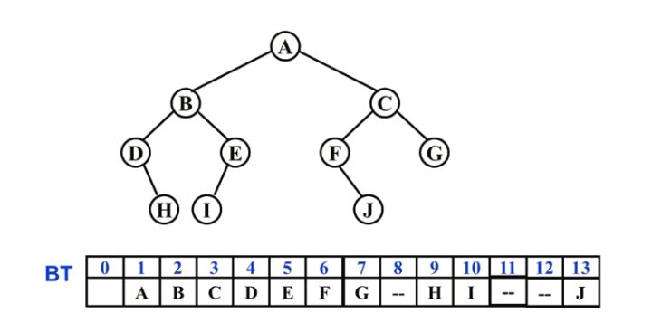

* [什么是树](#什么是树)
	* [树的特征](#树的特征)
	* [基本术语](#基本术语)
* [树的表示](#树的表示)
* [二叉树的定义](#二叉树的定义)
	* [二叉树具有五种基本形态](#二叉树具有五种基本形态)
	* [特殊二叉树](#特殊二叉树)
	* [重要性质](#重要性质)
	* [二叉树的遍历](#二叉树的遍历)
	* [二叉树的非递归遍历](#二叉树的非递归遍历)
	* [二叉树的层次遍历](#二叉树的层次遍历)
	* [输出叶子结点](#输出叶子结点)
	* [树的高度](#树的高度)
	* [由两种遍历序列确定二叉树](#由两种遍历序列确定二叉树)
* [抽象数据类型定义](#抽象数据类型定义)
* [顺序存储结构](#顺序存储结构)
* [链式存储](#链式存储)
* [树的同构](#树的同构)
* [二叉搜索树](#二叉搜索树)
* [相关代码](#相关代码)

# 什么是树
树(Tree)：n(n≥0)个结点构成的有限集合，当n=0时，称为空树。

## 树的特征
对于任一棵非空树(n＞0)，它具备以下特征：
* 树中有个称为“根(Root)”的特殊结点，用r表示；
* 其余结点可分为m(m>0)个互不相交的有限集T1,T2,…,Tm，其中每个集合本身又是一棵树，称为原来树的"子树(SubTree)"；
* 子树是不相交的；
* 除根结点外，每个结点有且仅有一个父结点；
* 一棵N个结点的树有N-1条边。

## 基本术语
* 结点的度(Degree)：结点的子树个数；
* 树的度：树的所有结点中最大的度数；
* 叶结点(Leaf)：度为 0 的结点；
* 父结点(Parent)：有子树的结点是其子树的根结点的父结点；
* 子结点(Child)：若A结点是B结点的父结点，则称B结点是A结点的子结点，也称孩子结点；
* 兄弟结点(Sibling)：具有同一父结点的各个结点彼此是兄弟结点；
* 路径：从结点n1到nk的路径为一个结点序列n1,n2,…,nk，ni是ni+1的父结点；
* 路径长度：路径所包含边的个数；
* 祖先结点(Ancestor)：沿树根到某一结点路径上的所有结点都是这个结点的祖先结点；
* 子孙结点(Descendant)：某一结点的子树中的所有结点是这个结点的子孙；
* 结点的层次(Level)：规定根结点在1层，其他任一结点的层数是其父结点的层数加一；
* 树的深度(Depth)：树中所有结点中的最大层次是这棵树的深度。

# 树的表示


**有没有更好的表示方法？**
**儿子-兄弟表示法**


首先树上的每个结点是统一的，就是两个指针域，一个叫FirstChild, 一个叫NextSibling，第一个指针指向的是它的第一个儿子，右边的指针是指向的下一个兄弟，所有的结点都以这种方式来指向儿子和兄弟，这样就可以把整个树的结点串起来


这样的表现方法有这样几个优点，一个是树当中的结构是统一的，都是两个指针域，同时空间浪费也不大，n个结点是2n个指针域，其中有n-1条边，所以意味着有n-1域是非空的，真正空的域是n+1,所以这种方法就是所说的儿子兄弟表示法，就是把一般的树变成结构上面比较一致的，都是两个指针的，这样的一种表示方法。

我们把这样的一种表示方法旋转45°


这个时候右边看到的就是一棵树，这个树的特点是每一个结点都有两个指针，一个指向左边，一个指向右边，每个结点最多是两个儿子，这种树叫二叉树，二叉树就是度为2的一种树，就是每个结点的指针最多是两个，所以一般的树都可以用儿子兄弟这样的一种表示方法把它用二叉树这种形式来实现，二叉树链表的形式来实现，所以我们想研究一般树的表示跟操作的实现，最核心的最基础的，如果我们搞清楚了二叉树是怎么表示，怎么实现的，实际上就解决了一般树的许多问题。

# 二叉树的定义
二叉树T：一个有穷的结点集合。
这个集合可以为空
若不为空，则它是由**根结点**和称为其**左子树** 和**右子树**的两个不想交的二叉树组成。

## 二叉树具有五种基本形态


1. 空树
2. 只有一个结点
3. 有一个结点，有左子树，但右子树是空的
4. 有一个结点，有右子树，但左子树是空的
5. 左右两边都不空

## 特殊二叉树

* 斜二叉树(Skewed Binary Tree)


* 完美二叉树(Perfect Binary Tree)/满二叉树(Full Binary Tree)


* 完全二叉树(Complete Binary Tree)
有n个结点的二叉树，对树中结点按从上至下，从左到右顺序进行编号，编号为i(1<=i<=n)结点与满二叉树中编号为i结点在二叉树中位置相同


## 重要性质


* 对任何非空二叉树T，若n0表示叶结点的个数，n2是度为2的非叶结点个数，那么两者满足关系 **n0=n2+1**。如何证明 n0 = n2 + 1？从边的角度来考虑这个问题，对于一棵树，我们来观察每个节点，每个节点往上看都有一条边，除了根结点没有边之外，每个结点都有一条边而且只有一条边，所以说从这个角度来看，边的总数是多少，是不是等于总的结点数减1，也就是n0 + n1 + n2 -1，这是我们总的结点数，减去1就是我们的边数，我们往下看，每个结点有的有一条边，有的两条边，有的什么边都没有，也就是说不同类型的结点对往下面的贡献是不一样的，n0的结点，没有儿子的结点，对往下的边的贡献数是等于0 x n0，n1这种结点是有一条往下边的，所以对边的贡献总数1 x n1，同样道理，我们有n2个结点，它往下有两条边，所以对边的贡献总数2 x n2，所以不管往上看往下看得出来的边的总数都是一样的，所以可以得到一个等式n0 + n1 + n2 -1 = 0 x n0 + 1 x n1 + 2 x n2，结论就可以证明出来了n0 = n2 + 1。

## 二叉树的遍历

二叉树的遍历最主要的有四种形式，先序遍历，中序遍历，后序遍历，层次遍历这四种形式，首先来讲讲先序遍历。

**先序遍历**

遍历过程为：
1. 访问根结点；
2. 先序遍历其左子树；
3. 先序遍历其右子树。

这样的一种遍历过程它实际上的话也是一种递归，要先去遍历这个树，就变成递归的遍历左子树和递归的遍历右子树，所以我们很自然的想到了用递归程序来实现。


A (B D F E) (C G H I ) 先是根，然后对左边递归，然后再对右边递归
先序遍历=> A B D F E C G H I

**中序遍历**

遍历过程为：
1. 中序遍历其左子树；
2. 访问根结点；
3. 中序遍历其右子树。


（D B E F) A (G H C I)
中序遍历 => D B E F A G H C I

**后序遍历**

遍历过程为：
1. 后序遍历其左子树；
2. 后序遍历其右子树；
3. 访问根结点。


我们这条路径是怎么画出来的，我们建立的基础是递归，是在递归的基础上面，我们根据递归的一些原理，一些规则，我们知道是这样的一个执行过程，实际上递归的事情是用堆栈的，后面会讲怎么借助堆栈把递归变成非递归。

## 二叉树的非递归遍历

递归根本的实现方法还是用堆栈，所以接下来想讲的一件事情是有没有可能直接用堆栈来实现，不用递归，所以这里我们举一个例子。

**中序遍历非递归遍历算法**

**非递归算法实现的基本思路：使用堆栈**


**中序遍历非递归遍历算法**

遇到一个结点，就把它压栈，并去遍历它的左子树；
当左子树遍历结束后，从栈顶弹出这个结点并访问它；
然后按其右指针再去中序遍历该结点的右子树。

```C++
void InOrderTraversal(BinTree BT){
	BinTree T = BT;
	Stack S = CreateStack(MaxSize);  /*创建并初始化堆栈S*/
	while(T || !IsEmpty(S)){
		while(T){  /*一直向左并将沿途结点压入堆栈*/
			Push(S, T);  // 第一次
			T = T->Left;
		}
		if (!IsEmpty(S)){
			T = Pop(S);  /*结点弹出堆栈*/  // 第二次
			printf("%5d", T->Data);  /*（访问）打印结点*/
			T = T->Right;  /*转向右子树*/
		}
	}
}
```

## 二叉树的层次遍历

**二叉树遍历的核心问题：二维结构的线性化**

**从结点访问其左，右儿子结点**

**访问左儿子后，右儿子结点怎么办？**

**需要一个存储结构保存暂时不访问的结点**

**存储结构：堆栈，队列**

**队列实现：遍历从根结点开始，首先将根结点入队，然后开始执行循环：结点出队，访问该结点，其左右儿子入队**

下面我们来看这样的一个例子，在这个例子里面我们用一个队列对整个过程进行访问，我们的方法是这样的


首先从根结点开始，把A放到队列里去，接下来就开始做循环了，每次循环做什么？三件事情，从队列里面抛出一个元素，print出来，然后把左右儿子放进去，所以这个A就是我们遍历的一个结果了。


然后再循环，又从队列里面抛出第一个元素，就是B,把B print出来，输出，然后把它的左右儿子D,F放到队列里面去


再把C从队列里抛出来，把它的左右儿子放进去


D抛出来，左右儿子放进去，D没有左右儿子了，这个就没有元素要放到队列里面去了，进一步做这个循环，队列里面再抛出一个元素F,再把左右儿子放进去，现在只有左儿子E


然后再从队列里抛出G,再左右儿子放进去，就这样一个个做，最后得到结果。


这样的话，我们就把树这样的二维结构线性化，变成一个线性序列，这个序列有什么特征？

这个序列的特征是一层一层访问的。

**层序基本过程：先根结点入队，然后：**

**1.从队列中取出一个元素；**

**2.访问该元素所指结点；**

**3.若该元素所指结点的左，右孩子结点非空，则将其左，右孩子的指针顺序入队。**

```C++
void LevelOrderTraversal(BinTree BT){
	Queue Q; BinTree T;
	if (!BT) return;  /*若是空树则直接返回*/
	Q = CreateQueue(MaxSize);  /*创建并初始化队列Q*/
	AddQ(Q, BT);
	while (!IsEmptyQ(Q)){
		T = DeleteQ(Q);
		printf("%d\n", T->Data);  /*访问取出队列的结点*/
		if (T->Left) AddQ(Q, T->Left);
		if (T->Right) AddQ(Q, T->Right);
	}
}
```

## 输出叶子结点
在二叉树的遍历算法中增加检测结点的"左右子树是否都为空"。
```C++
void PreOrderPrintLeaves(BinTree BT){
	if (BT){
		if(!BT->Left && !BT->Right)
			printf("%d ", BT->Data);
		PreOrderPrintLeaves(BT->Left);
		PreOrderPrintLeaves(BT->Right);
	}
}
```
## 树的高度

```C++
int PostOrderGetHeight(BinTree BT){
    int HL, HR, MaxH;
    if(BT){
        HL = PostOrderGetHeight(BT->Left);  /*求左子树的深度*/
        HR = PostOrderGetHeight(BT->Right); /*求右子树的深度*/
        MaxH = (HL > HR) ? HL : HR;  /*取左右子树较大的深度*/
        return (MaxH + 1);  /*返回树的深度*/
    }
    else return 0;  /*空树深度为0*/
}
```

## 由两种遍历序列确定二叉树


# 抽象数据类型定义

* 类型名称：二叉树
* 数据对象集：一个有穷的结点集合，若不为空，则由根结点和其左、右二叉子树组成
* 操作集：BT∈BinTree，元素为Item
* 主要操作有：
* Boolean IsEmpty(BinTree BT)：判别 BT 是否为空
* void Traversal(BinTree BT)：遍历，按某顺序访问每个结点
* BinTree CreatBinTree()：创建一个二叉树
* 常用的遍历方法有：
* void PreOrderTraversal(BinTree BT)：先序——根、左子树、右子树
* void InOrderTraversal(BinTree BT)：中序——左子树、根、右子树
* void PostOrderTraversal(BinTree BT)：后序——左子树、右子树、根
* void LevelOrderTraversal(BinTree BT)：层次遍历，从上到下、从左到右

# 顺序存储结构
按从上至下、从左到右顺序存储 n 个结点的完全二叉树的结点父子关系：
* 非根结点(序号i>1)的父结点的序号是i/2(向下取整)；
* 结点(序号为i)的左孩子结点的序号是2i(若2i≤n)，否则没有左孩子；
* 结点(序号为i)的右孩子结点的序号是2i+1(若2i+1≤n)，否则没有右孩子。


- [x] [树的顺序存储结构实现](./Arr_tree.cc)

# 链式存储


- [x] [树的链式存储结构实现](./Tree.cc)

# 树的同构
给定两棵树T1和T2。如果T1可以通过若干次左右孩子互换就变成T2，则我们称两颗树是"同构"的。


## 求解思路

1. 二叉树表示
2. 建二叉树
3. 同构判别

二叉树最常用方式是用链表，但是也不完全要用链表，也可以用数组来表示，那么我们这道题里面等会就是用数组来表示二叉树
怎么建二叉树，就是怎么从输入的数据里面来建立相应的二叉树，建立两个二叉树之后，怎么判别两棵树是不是同构

## 二叉树表示

**链表表示**


**数组表示：就是把二叉树看成一个完全二叉树**



用完全二叉树的组织形式来表示二叉树，缺少了结点在数组里面把它空出来，这个是一般的用数组表示二叉树的做法

## 二叉树表示

结构数组表示二叉树：静态链表

我们基本的存储是用数组，把我们所需要的结点信息存储在数组里面，但是左右儿子用类似链表的这种方法来表示，有一个数据来指示左儿子在哪里，右儿子在哪里，物理上的存储是数组，但是它的思想是一种链表的思想，所以这种链表我们称为静态链表。


比方说这样的一个二叉树，四个结点，怎么用结构数组来表示呢？那么一种表示方法是表示成这样：


这是一个数组，数组里的每个分量是个结构，也就代表了大家看到的每一列


- [x] [二叉树同构实现](./Isomorphic.cc)

# 二叉搜索树

查找问题

* 静态查找与动态查找
* 针对动态查找，数据如何组织

静态查找：找的集合的元素是不动的，也就是在一个集合上主要做的是find操作，而没有delete, insert这种操作发生。
动态查找：我们要找的对象集合本身会动态的发生变化，也就是经常要发生插入删除，除了查找之外，还有插入删除发生。

静态查找问题呢，我们前面提到过，一个很好的方法，就是二分查找，二分查找把一般查找的时间复杂性O(n)降到了O(log2n),为什么二分查找效率这么好，其中很重要的原因，我们把要查找的数据事先进行了有效的组织，把它有序化，这样的话，给定了n个数，我们查找的顺序可以形成判定树这样的一种结构，所以把一个线性的查找过程，变成一个类似树的查找过程，而它的查找效率就是树的高度，所以从这里面我们得到一个启示，有没有可能直接把元素就放到树上，不要放在数组里面，放在树上的一个好处，树的动态性比较强，要插入删除比在线性里面做要方便，这就是我们要讲的二叉查找树，或者叫二叉搜索树。

我们怎么把元素放在树上面，从前面我们的判定树里面我们可以得到一个启示，我们有没有可能把数据按这种方式来组织，也就是树上的任何一个节点，它的值比所有左子树的值都要来的大，比右子树的所有节点值都要来的小，这样我们的查找过程就变成对当前结点的一个判断，是大于，小于，还是等于，等于就找着了，如果比当前的根结点要小，那么我们就到左边去找，如果比它大，到右边去找，这样也能把我们的查找过程缩小一大部分。所以这就是我们所说的二叉搜索树。

> 二分查找的时间复杂度：
> 总共有n个元素，每次查找的区间大小就是n, n/2, n/4, …, n/2^k（接下来操作元素的剩余个数），其中k就是循环的次数。
> 由于n/2^k取整后>=1，最坏情况n/2^k=1，
> 可得k=log2n,（是以2为底，n的对数），所以时间复杂度可以表示O()=O(log2n)

## 二叉搜索树(BST,Binary Search Tree),也称二叉排序树或二叉查找树

二叉搜索树：一棵二叉树，可以为空；如果不为空，满足以下性质：
1. 非空**左子树**的所有**键值小于其根结点**的键值。
2. 非空**右子树**的所有**键值大于其根结点**的键值。
3. **左，右子树都是二叉搜索树。**


因为5这个结点比10小，二叉搜索树的右子树应该比根结点大。


这里的所有结点数都满足。


二叉搜索树操作的特别函数：


## 二叉搜索树的查找操作：Find

查找从根结点开始，如果**树为空，返回NULL**
若搜索树非空，则根结点**关键字和X进行比较，**并进行不同处理：
1. 若**X小于根结点键值**，只需在**左子树**中继续搜索；
2. 如果**X大于根结点的键值，**在**右子树**中进行继续搜索；
3. 若两者比较结果是**相等，**搜索完成，返回指向此结点的指针。


```C++
Position Find(ElementType X, BinTree BST)
{
    if (!BST) return NULL;  /*查找失败*/
    if (X > BST->Data)
        return Find(X, BST->Right);  /*在右子树中继续查找*/
    else if (X < BST->Data)
        return Find(X, BST->Left);  /*在左子树中继续查找*/
    else  /*X == BST->Data*/
        return BST;  /*查找成功，返回结点的找到结点的地址*/
}
```


这里是用递归的方式来实现，递归实现的方式不是很好，而且我们注意到，这种递归叫尾递归，就是在程序分支的最后，需要返回的时候实现递归。从编译的角度来讲，尾递归都可以用循环来进行实现
由于**非递归函数**的执行**效率高，**可将"尾递归"函数改为**迭代函数**

```C++
Position IterFind(ElementType X, BinTree BST)
{
    while(BST){
        if(X > BST->Data)
            BST = BST->Right;  /*向右子树中移动，继续查找*/
        else if(X < BST->Data)
            BST = BST->Left;  /*向左子树中移动，继续查找*/
        else  /*X == BST->Data */
            return BST;  /*查找成功，返回结点的找到结点的地址*/
    }
    return NULL;  /*查找失败*/
}
```

**查找的效率决定于树的高度**

因为我们可能一直找，找到叶结点为止，而对同样的n个结点来讲，树的高度跟树的结构是很有关系的，如果树的结构不好，都只有左儿子，没有右儿子，全部串在一起，形成一条链，往左边倾斜，它的高度是n-1，这是最坏的情况，当然还有一种情况大家都往右边靠，那么就是在右边形成一条链，那这就达到我们想要的log(n)这样的一种效果，所以总的来讲我们希望树看起来比较平衡，就不往一边倒，所以这就是我们后面要提到的一个重要的议题，叫**平衡二叉树**

**查找最大和最小元素**
**最大元素**一定是在树的**最右分支的端结点**上
**最小元素**一定是在树的**最左分支的端结点**上


```C++
Position FindMin(BinTree BST){
    if (!BST) return NULL;  /*空的二叉搜索树，返回NULL*/
    else if(!BST -> Left)
        return BST;  /*找到最左叶结点并返回*/
    else
        return FindMin(BST->Left);  /*沿左分支继续查找*/
}
```
*查找最小元素的递归函数*

```C++
Position FindMax(BinTree BST){
    if (BST)
        while(BST->Right)   BST = BST->Right;
            /*沿右分支继续查找，直到最右叶结点*/    
    return BST;
}
```
*查找最大元素的迭代函数*

## **二叉搜索树的插入**

【分析】关键是要找到元素应该插入的**位置，**可以采用与Find类似的方法。


所以这个过程跟Find是一样的。但和Find不同之处在于35要挂在33的右边，而这个时候就必须记住33这个位置，如果忘掉了，就不知道要挂哪里去了，所以这就是我们做insert操作时需要注意的地方，我们有种方法来处理事情。

二叉搜索树的插入算法

```C++
BinTree Insert(ElementType X, BinTree BST){
    if (!BST){
        /*若原树为空，生成并返回一个结点的二叉搜索树*/
        BST = malloc(sizeof(struct TreeNode));
        BST->Data = X;
        BST->Left = BST->Right = NULL;
    } else  /*开始找要插入元素的位置*/
       if(X < BST->Data)
           BST->Left = Insert(X, BST->Left);  /*递归插入左子树*/
       else if(X > BST->Data)
           BST->Right = Insert(X, BST->Right);  /*递归插入右子树*/
       /*else X已经存在，什么都不做*/
    return BST;
}
```

往空树里面插入一个结点，就新申请一个结构，然后它就返回。这个程序在什么时候发生？什么时候会执行这个分支？这个分支就是刚才35要插在33右边的时候，程序过程是这样，假如当前的结点是BST指向33，然后递归，递归一进来之后就发现，如果BST是空的，现在不空，就不申请结点了，然后如果比它小，到左边去插入，比它大，右边插入。现在X值35，比它大，这个BST的值是33，所以这个时候就做一次递归了（这里有点疑惑）


那么这个就变成什么了？这个就变得跟查找很像了

## 二叉搜索树的删除

考虑**三种情况**：

要删除的是**叶结点**：直接删除，并再修改其父结点指针--置为NULL


我们要删除的是35，首先要找到35，所以这个过程也是查找过程，找到了35之后，就把它拿掉，对应的把33的right的指针设为NULL，这是一种情况，还有一种情况，只有一个儿子，只有一个左儿子，或只有一个右儿子，那么这个删除怎么做？

要删除的结点**只有一个孩子**结点：

将其**父结点**的指针**指向**要删除结点的**孩子结点**


找到33的时候，知道33只有一个左儿子或者只有一个右儿子，在我们这个情况下，只有一个右儿子，那么要把它删掉，很简单，就把35挂在41的左边就可以了，因为它只有一个儿子，只有一个指针到下面去，就把这个指针拉到上面这一层，让它的父亲指向它的孙子结点，就可以了，所以这个过程也比较简单


要删除的结点**有左，右两棵子树：**

用另一结点替代被删除结点：**右子树的最小元素**或者**左子树的最大元素**

比较复杂的情况是左右两边都不空，这个时候我们的一个策略是把复杂的情况简单化，我们知道没有儿子结点怎么删除了，只有一个儿子结点怎么删除了，但你有两个儿子结点的时候，我能不能把有两个儿子结点的情况把它转化成只有一个儿子或者没有儿子的情况？这是做的到的。


我们想删除41，41左右两边都不空，有两种策略，一种在右子树里面找个最小，在这个情况中右子树只有一个情况，是50来替代它，那么就完成了这样的一个删除过程。

还有一种是左子树里面，找一个最大，左子树最大是35，用35来替代它，就是把删除41，变成删除35，把35值拷贝过去，然后去删除这个位置


所以左右两个子树都不空的情况下，我们要删除一个结点，变成去左子树里找个最大值，右子树找个最小值来替代这个位置，好处是左子树的最大值，右子树的最小值一定不是有两个儿子的结点


# 相关代码

- [x] [顺序查找实现](./Sequential_search.cc)